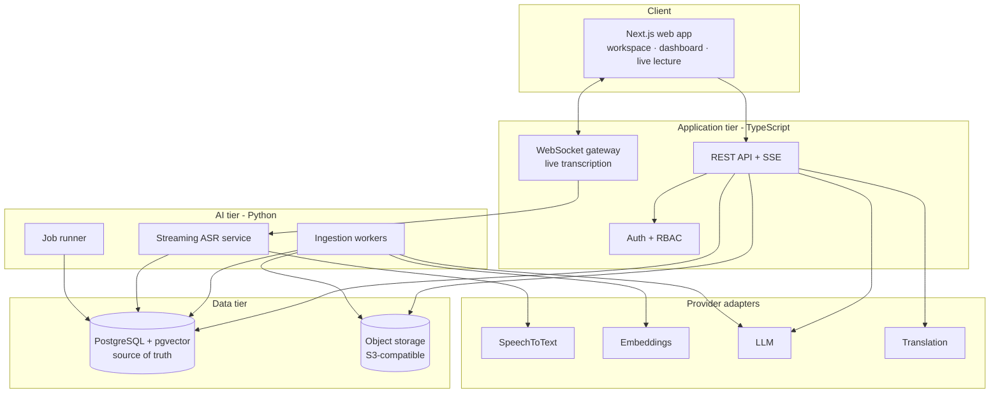

# ARCHITECTURE.md

System architecture for Sanad — an AI academic companion built on a structured academic knowledge base.

**Status:** proposed, awaiting review. No application code has been written.

Companion documents: [DATABASE.md](DATABASE.md) · [API.md](API.md) · [AI_PIPELINE.md](AI_PIPELINE.md) · [MVP.md](MVP.md) · [ASR_BENCHMARK.md](ASR_BENCHMARK.md)

---

## 1. What is being built

Sanad supports a student across one continuous journey:

**Before the lecture → during the lecture → after the lecture → daily studying → exam preparation.**

The architectural consequence of that sentence is that Sanad is *not* an LLM with a university-themed UI. It is a structured academic knowledge system — Postgres, transcripts, materials, timestamps, retrieval, citations, learning records — on which an LLM operates as one replaceable component.

Concretely, this means the LLM never holds state, never decides schedules, and never produces a user-visible claim that the database cannot source. Every one of those responsibilities belongs to application code and to tables.

### 1.1 The rule above all others: course-agnostic

**No subject, department, topic, or vocabulary may exist in application code.** Everything academic is configurable data.

| Concern | Wrong (hard-coded) | Right (data) |
|---|---|---|
| Terminology | A `DIGITAL_LOGIC_TERMS` constant | Rows in `course_vocabulary`, scoped to a course |
| Topics | An enum of topic names | Rows in `study_topics`, derived per course from its own content |
| Emphasis cues | A literal array of Arabic phrases in a service | Rows in `emphasis_cues`, per language, seeded and editable |
| Question styles | A prompt that says "for logic circuits…" | Course-level `question_profile` config, defaulting to generic |
| Academic structure | Assumed year/semester shape | `universities → faculties → departments → courses → offerings` |

**Enforcement, not just intention.** A CI check (`scripts/check-course-agnostic.sh`) greps `apps/` and `packages/` for a denylist of subject terms — the names of demo courses, their vocabulary, and their topics — and fails the build on any hit outside `seed/`, `fixtures/`, and `**/*.test.*`. The denylist is generated from the seed data itself, so it grows automatically as demo courses are added. This turns rule §32 from a promise into a test.

Digital Logic exists **only** as a seed fixture and an ASR benchmark dataset. Loading a Chemistry course must require zero code changes.

---

## 2. Architecture at a glance



Two runtimes, one database, one schema owner.

---

## 3. Technology decisions

Each decision below states the alternative considered and why it lost, so the team can reopen one deliberately rather than by accident.

### 3.1 PostgreSQL 16 + pgvector — single source of truth

Required by the brief and correct regardless. The data is deeply relational (student → enrollment → course → lecture → segment → citation) and correctness matters more than write throughput. `pgvector` keeps embeddings beside the rows they describe, so a retrieval result and its citation anchor come from one query with no cross-store consistency problem.

*Rejected:* a dedicated vector database. It would add a second store to keep in sync for a corpus that is small (a course-semester is tens of thousands of chunks) and would put the citation anchor in a different system from the row it must point at — exactly the seam where fabricated citations appear.

### 3.2 TypeScript for the product tier, Python for the AI tier

Python owns what only Python does well: `faster-whisper`, `PyMuPDF`, `python-pptx`, audio processing. TypeScript owns the product surface, where end-to-end type safety from database to UI has the most value.

**The seam is the risk**, so it is designed explicitly: contracts are defined once as Zod schemas in `packages/contracts`, and a build step emits JSON Schema plus generated Pydantic models. Neither side hand-writes the other's types, and a contract change fails the build on both sides.

*Rejected:* all-Python (loses typed UI integration) and all-TypeScript (would force hosted-only ASR, removing our ability to tune and benchmark the pipeline — see [ASR_BENCHMARK.md](ASR_BENCHMARK.md)).

### 3.3 Drizzle ORM — sole owner of schema and migrations

Drizzle is SQL-first, emits reviewable migration files, and handles `vector` columns and custom index types without escape hatches. **Migrations have exactly one owner.** The Python tier reads and writes the same tables via SQLAlchemy Core, but never defines or alters schema — no second migration history, ever.

*Rejected:* Prisma (awkward pgvector support, less transparent SQL); dual ORMs with two migration sources (guaranteed drift).

### 3.4 Postgres-backed job queue — no Redis in the MVP

Background work (ingestion, embedding, summarization, exam generation) runs from a `processing_jobs` table drained with `SELECT … FOR UPDATE SKIP LOCKED`.

This is not a compromise, it is a better fit:
- Job status is already a product requirement (§18 requires `processing_status` on materials) — with a table, the UI reads status with a normal join instead of polling a broker.
- Job state is transactional with the data it produces. A crash mid-embedding cannot leave a chunk row without its job record.
- One less service to run, deploy, and have fail during a demo.

*Revisit when:* sustained throughput exceeds roughly 50 jobs/second, or fan-out across many worker hosts begins to contend. Then introduce Redis + a real broker behind the same `JobQueue` interface. The interface exists from day one specifically so that swap is contained.

### 3.5 S3-compatible object storage behind an interface

Binary files never enter Postgres (§18). Browsers upload directly via presigned URLs, so large media never transits the API tier. MinIO locally, S3/R2 in production, both behind a `StorageProvider` interface, following the same pattern as §6.

### 3.6 Next.js (App Router) + React

Server components for data-dense pages, one deployment for UI and API, and a straightforward PWA path when offline caching arrives later. RTL and localization are handled at the framework level (§8).

### 3.7 Auth: server sessions, not stateless JWTs

Opaque session tokens in an httpOnly cookie, sessions stored in Postgres, Argon2id password hashing. Revocation is a row delete — which matters for an app holding recorded lectures. Stateless JWTs would trade that for scale we do not have.

---

## 4. Module map

```
sanad/
├── apps/
│   ├── web/                    # Next.js — UI, REST API, SSE, WebSocket gateway
│   │   ├── app/(auth)/         # sign-in, registration
│   │   ├── app/(app)/          # dashboard, course, lecture, workspace
│   │   └── app/api/v1/         # REST handlers — thin, delegate to packages/core
│   └── ai/                     # Python — FastAPI + job runner
│       ├── asr/                # streaming recognition, VAD, confidence
│       ├── ingestion/          # extractors per file type, chunking
│       ├── enrichment/         # summaries, keywords, topics, emphasis, generation
│       └── providers/          # provider adapters (Python side)
├── packages/
│   ├── db/                     # Drizzle schema + migrations  ← sole schema owner
│   ├── core/                   # domain services: retrieval, citation validation,
│   │                           #   mastery, scheduler, permissions
│   ├── contracts/              # Zod schemas → JSON Schema → Pydantic
│   ├── providers/              # provider interfaces + adapters (TS side)
│   └── ui/                     # design system, RTL-aware primitives
├── seed/                       # demo courses, vocabulary, emphasis cues
├── benchmarks/asr/             # datasets, harness, results
└── scripts/                    # check-course-agnostic.sh, migrate, seed
```

**Dependency rule:** `apps/*` depend on `packages/*`; `packages/*` never depend on `apps/*`; `packages/core` never imports a provider SDK directly, only the interfaces in `packages/providers`. Business rules stay testable without network or model access.

---

## 5. Principal flows

### 5.1 Live lecture

```
browser mic
  → WebSocket (auth + lecture_session_id)
  → VAD segmentation
  → streaming ASR                    → DRAFT segment (client renders, unsaved)
  → segment finalized on speech pause → transcript_segments row (raw preserved)
  → term correction (async)          → term_corrections rows + corrected text
  → emphasis detection (async)       → lecture_emphasis rows
  → chunk + embed (async)            → content_chunks rows
```

Draft text is never persisted; only finalized segments are. The raw ASR output is stored permanently alongside every correction, so no pipeline stage can destroy the original (§3 and §5 of the brief).

### 5.2 Material ingestion

```
presigned upload → materials row (status=uploaded)
  → job: extract    (per-type extractor → normalized text + anchors)
  → job: chunk      (semantic chunking, anchors carried through)
  → job: embed      (batched, provider-abstracted)
  → job: enrich     (keywords, topic links)
  → status=ready
```

Each step is a separate job with its own retry policy and its own failure surface, so a broken PDF fails at extraction with a specific, user-visible reason rather than silently producing an empty index.

### 5.3 Grounded question

```
question
  → hybrid retrieval (vector + lexical + RRF + rerank)
  → CONFIDENCE GATE ─ below threshold ─→ refusal (no LLM call at all)
  → generate with retrieved context only
  → CITATION VALIDATION ─ drop any citation not in the retrieved set
  → if zero citations survive ─→ refusal
  → render with jump-to-source anchors
```

Two independent gates, both in application code. Detailed in [AI_PIPELINE.md](AI_PIPELINE.md) §6.

---

## 6. Provider abstraction

Five capabilities are abstracted (§19). Interfaces live in `packages/providers`; nothing in `packages/core` imports a vendor SDK.

```ts
interface SpeechToTextProvider {
  transcribeStream(audio: AsyncIterable<AudioChunk>, opts: AsrOptions): AsyncIterable<AsrSegment>;
  transcribeFile(ref: StorageRef, opts: AsrOptions): Promise<AsrResult>;
  readonly capabilities: { streaming: boolean; languageHints: boolean; wordTimestamps: boolean };
}

interface EmbeddingProvider {
  embed(texts: string[], opts: { kind: 'document' | 'query' }): Promise<Float32Array[]>;
  readonly dimensions: number;
  readonly modelId: string;      // persisted per row — see DATABASE.md §12
}

interface LlmProvider {
  complete(req: LlmRequest): Promise<LlmResponse>;
  completeStructured<T>(req: LlmRequest, schema: JsonSchema): Promise<T>;
  stream(req: LlmRequest): AsyncIterable<LlmDelta>;
}

interface TranslationProvider { translate(req: TranslationRequest): Promise<TranslationResult>; }
interface SummarizationProvider { summarize(req: SummarizationRequest): Promise<SummaryResult>; }
```

**Three rules that make the abstraction real rather than decorative:**

1. **Model identity is persisted, not assumed.** Every embedding row records `embedding_model` and `embedding_dimensions`. Changing models is then a visible backfill with a mixed-state period the query layer handles, not a silent corruption of the index.
2. **Capabilities are declared.** Callers branch on `provider.capabilities`, never on a provider's name.
3. **Selection is configuration.** Provider and model per capability come from environment config, overridable per course for evaluation — which is what lets [ASR_BENCHMARK.md](ASR_BENCHMARK.md) run competing engines against the same audio through the same code path.

Initial selections and cost analysis are in [AI_PIPELINE.md](AI_PIPELINE.md) §11.

---

## 7. Authentication and authorization

**Roles:** `student`, `teaching_assistant`, `instructor`, `admin` — on the user, with per-course scoping through `course_enrollments` and `course_staff`.

Authorization is **resource-scoped, evaluated centrally** in `packages/core/permissions`. Every data-returning endpoint resolves a subject → resource → action decision; no handler writes its own ownership check, because ownership checks written per-handler are how one endpoint ends up leaking another student's recordings.

| Resource | Student | TA | Instructor | Admin |
|---|---|---|---|---|
| Own lectures, materials, notes | CRUD | — | — | read (audit) |
| Enrolled course content | read | read | read | read |
| Course vocabulary | read | propose | CRUD | CRUD |
| Course staff assignment | — | — | — | CRUD |
| Aggregate analytics | own only | course (deferred) | course (deferred) | all |

Personal data is limited to what §20 lists. Recordings belong to the student who made them; instructor-uploaded content is a separate future path (§23) and is deliberately not modelled as instructor access to student recordings.

---

## 8. Frontend structure

Four surfaces (§21): **Dashboard**, **Course**, **Lecture**, and the **AI Workspace** that unifies transcript, materials, search, chat, and sources.

**Source-attributed rendering is a shared primitive.** Every generated string in the UI is rendered by a `<Sourced>` component that takes content plus validated citations and renders jump-to-source affordances. There is no path to display generated text without passing through it — which is how §22 becomes structural rather than a convention people forget.

**Bilingual and RTL from the start**, because retrofitting it is expensive:
- **Interface language** and **content language** are independent. A student may read an Arabic UI over an English transcript.
- `dir` is set from the interface locale; all CSS uses logical properties (`margin-inline-start`, never `margin-left`).
- Mixed-script content — the normal case for a code-switched transcript — is isolated per span so bidirectional reordering cannot scramble a sentence.
- All copy lives in message catalogues from commit one.

---

## 9. Cross-cutting concerns

**Configuration.** All secrets from environment variables, validated at boot by a Zod schema that fails fast on a missing key. `.env.example` committed; `.env` never. No key in Git, enforced by a pre-commit secret scan.

**Errors.** RFC 9457 `application/problem+json`. AI-tier failures degrade visibly and specifically — "transcription unavailable", not a spinner that never resolves.

**Logging.** Structured JSON with a request ID propagated across the TS/Python boundary. Every LLM call logs model, token counts, latency, and cost estimate. Prompt and response bodies are logged only at debug level and never in production, because they contain lecture content.

**Testing.** Unit tests for pure domain logic (scheduler, mastery, citation validation, RRF); integration tests against a real Postgres via Testcontainers; contract tests asserting the TS and Python views of a payload agree; and evaluation suites for retrieval quality and refusal behaviour, which are correctness tests here rather than nice-to-haves.

**Accessibility.** Keyboard-navigable transcript and citation jumps, visible focus, semantic landmarks, captions as first-class text. A transcription product that fails a screen reader would be an embarrassing irony.

---

## 10. Risks and assumptions

Ranked by probability × impact.

| # | Risk | Why it matters | Mitigation |
|---|---|---|---|
| 1 | **Code-switched technical ASR underperforms** | Load-bearing for the entire product | [ASR_BENCHMARK.md](ASR_BENCHMARK.md) runs in Phase 0, before the pipeline is built. Decision gate with defined thresholds. |
| 2 | **Silent translation instead of transcription** | Whisper-family models sometimes translate at a language switch; quiet and destroys code-switching | Pin task=transcribe; make translation-leak an explicit benchmark metric with a hard ceiling |
| 3 | **Cross-lingual retrieval misses** | Arabic query must find English content or search fails for the target user | Multilingual embeddings + vocabulary-driven term expansion at index time; Arabic query set in the retrieval eval |
| 4 | **Citations that look valid but aren't** | Destroys the product's core trust claim | Validation against the retrieved set; anchors resolved from rows, never model output; refusal on zero survivors |
| 5 | **Cost or latency of enrichment at scale** | Every lecture triggers several LLM passes | Batch API for non-interactive work; prompt caching over stable course context; cost budget per course tracked in logs |
| 6 | **Schema churn once retrieval is live** | Late migrations over embedded content are expensive | Freeze `content_chunks` and the citation contract at the end of Phase 2 |
| 7 | **Course-agnostic drift under demo pressure** | A hard-coded shortcut before a deadline is the likeliest way §32 breaks | CI denylist check from day one |

### Assumptions requiring confirmation

1. Lecture recording is initiated by the student on their own device (institutional capture is future work).
2. A single active live session per user is sufficient for the MVP.
3. Typical course size is tens of lectures and hundreds of materials — sizing that allows the simplifications in §3.4.
4. GPU capacity is available for self-hosted ASR during development and demo; if not, decision 3.2 needs revisiting toward hosted ASR.
5. Handwritten Arabic OCR is best-effort; printed and typed material is the supported path.

---

## 11. Open questions for review

1. **ASR hosting** — self-hosted GPU, hosted API, or hybrid (streaming self-hosted, batch hosted)? Answered by the Phase 0 benchmark, but budget and hardware constrain it now.
2. **Embedding model** — a 1024-dimension multilingual model is assumed for index sizing. Confirm before Phase 5, since changing it later means a full re-embed.
3. **Course provisioning** — does a student create their own courses, or join institution-provisioned ones? Affects `course_offerings` and enrollment UX. Recommendation: student-created for the MVP, institution-provisioned as the additive path.
4. **Translation scope** — is translated display in the MVP, or only the architecture that supports it? Recommendation: architecture and storage now, one non-source language enabled in the UI later.
5. **Retention** — how long are recordings kept, and what does account deletion remove? Needs an answer before real lecture audio is collected in Phase 0.
