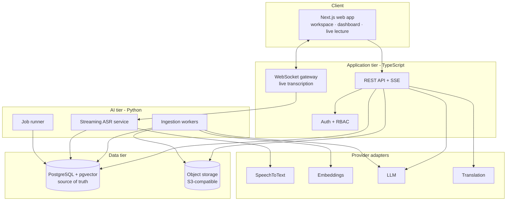

# ARCHITECTURE.md

System architecture for Sanad — an AI academic companion built on a structured academic knowledge base.

**Status:** decisions finalized; Phase 1 (foundation) implemented. Phases 2–10 not started.

Companion documents: [DATABASE.md](DATABASE.md) · [API.md](API.md) · [AI_PIPELINE.md](AI_PIPELINE.md) · [MVP.md](MVP.md) · [ASR_BENCHMARK.md](ASR_BENCHMARK.md)

---

## 1. What is being built

Sanad supports a student across one continuous journey:

**Before the lecture → during the lecture → after the lecture → daily studying → exam preparation.**

The architectural consequence of that sentence is that Sanad is *not* an LLM with a university-themed UI. It is a structured academic knowledge system — Postgres, transcripts, materials, timestamps, retrieval, citations, learning records — on which an LLM operates as one replaceable component.

Concretely, this means the LLM never holds state, never decides schedules, and never produces a user-visible claim that the database cannot source. Every one of those responsibilities belongs to application code and to tables.

### 1.1 The rule above all others: course-agnostic

**No subject, department, topic, or vocabulary may exist in application code.** Everything academic is configurable data.

| Concern | Wrong (hard-coded) | Right (data) |
|---|---|---|
| Terminology | A `DIGITAL_LOGIC_TERMS` constant | Rows in `course_vocabulary`, scoped to a course |
| Topics | An enum of topic names | Rows in `study_topics`, derived per course from its own content |
| Emphasis cues | A literal array of Arabic phrases in a service | Rows in `emphasis_cues`, per language, seeded and editable |
| Question styles | A prompt that says "for logic circuits…" | Course-level `question_profile` config, defaulting to generic |
| Academic structure | Assumed year/semester shape | `universities → faculties → departments → courses → offerings` |

**Enforcement, not just intention.** A CI check (`scripts/check-course-agnostic.sh`) greps `apps/` and `packages/` for a denylist of subject terms — the names of demo courses, their vocabulary, and their topics — and fails the build on any hit outside `seed/`, `fixtures/`, and `**/*.test.*`. The denylist is generated from the seed data itself, so it grows automatically as demo courses are added. This turns rule §32 from a promise into a test.

Digital Logic exists **only** as a seed fixture and an ASR benchmark dataset. Loading a Chemistry course must require zero code changes.

---

## 2. Architecture at a glance



Two runtimes, one database, one schema owner.

---

## 3. Technology decisions

Each decision below states the alternative considered and why it lost, so the team can reopen one deliberately rather than by accident.

### 3.1 PostgreSQL 16 + pgvector — single source of truth

Required by the brief and correct regardless. The data is deeply relational (student → enrollment → course → lecture → segment → citation) and correctness matters more than write throughput. `pgvector` keeps embeddings beside the rows they describe, so a retrieval result and its citation anchor come from one query with no cross-store consistency problem.

*Rejected:* a dedicated vector database. It would add a second store to keep in sync for a corpus that is small (a course-semester is tens of thousands of chunks) and would put the citation anchor in a different system from the row it must point at — exactly the seam where fabricated citations appear.

### 3.2 TypeScript for the product tier, Python for the AI tier

ASR is a hosted API (§3.8), so the application tier calls it over HTTP and needs no Python for speech. Python's remaining justification is narrower but still real: document extraction (`PyMuPDF`, `python-pptx`, `python-docx`) and audio post-processing (ffmpeg), where the library ecosystem is materially better than the JS equivalent.

**Consequence: the Python tier is not needed until Phase 2.** Phase 1 is TypeScript only — building a Python service earlier would be scaffolding with nothing to run.

**The seam is the risk**, so it is designed explicitly: contracts are defined once as Zod schemas in `packages/contracts`, and a build step emits JSON Schema plus generated Pydantic models. Neither side hand-writes the other's types, and a contract change fails the build on both sides.

*Rejected:* all-Python (loses typed UI integration). An all-TypeScript ingestion tier is no longer unreasonable now that ASR is hosted, and is worth revisiting if the Python surface stays thin — the decision is reversible because extraction sits behind the `Extractor` interface ([AI_PIPELINE.md](AI_PIPELINE.md) §5).

### 3.3 Drizzle ORM — sole owner of schema and migrations

Drizzle is SQL-first, emits reviewable migration files, and handles `vector` columns and custom index types without escape hatches. **Migrations have exactly one owner.** The Python tier reads and writes the same tables via SQLAlchemy Core, but never defines or alters schema — no second migration history, ever.

*Rejected:* Prisma (awkward pgvector support, less transparent SQL); dual ORMs with two migration sources (guaranteed drift).

### 3.4 Postgres-backed job queue — no Redis in the MVP

Background work (ingestion, embedding, summarization, exam generation) runs from a `processing_jobs` table drained with `SELECT … FOR UPDATE SKIP LOCKED`.

This is not a compromise, it is a better fit:
- Job status is already a product requirement (§18 requires `processing_status` on materials) — with a table, the UI reads status with a normal join instead of polling a broker.
- Job state is transactional with the data it produces. A crash mid-embedding cannot leave a chunk row without its job record.
- One less service to run, deploy, and have fail during a demo.

*Revisit when:* sustained throughput exceeds roughly 50 jobs/second, or fan-out across many worker hosts begins to contend. Then introduce Redis + a real broker behind the same `JobQueue` interface. The interface exists from day one specifically so that swap is contained.

### 3.5 S3-compatible object storage behind an interface

Binary files never enter Postgres (§18). Browsers upload directly via presigned URLs, so large media never transits the API tier. MinIO locally, S3/R2 in production, both behind a `StorageProvider` interface, following the same pattern as §6.

### 3.6 One responsive application for web and mobile

Sanad must work on both web and mobile without becoming two products. The decision is **one Next.js application, installable as a PWA**, with a shared API and a shared domain model — not a web app plus a separately-built native app.

This works because the mobile-critical capabilities are all available to a PWA: `MediaRecorder` for lecture capture, `getUserMedia` constraints for audio cleanup (§3.10), IndexedDB for offline storage, and service workers for offline shell and background upload.

Platform differences are handled by **layout and emphasis, not by a second codebase**: mobile leads with recording, live transcript, quick search, and study sessions; desktop leads with upload, archive management, reading, and the AI workspace. Same endpoints, same domain model, same permission rules.

*Revisit when:* background audio capture with the screen locked, or OS-level media controls, become required. Those are the genuine PWA limits. The remedy then is a thin native shell (Capacitor) around the same application — not a rewrite — which is why the offline layer in §3.10 is designed as a storage/sync abstraction rather than browser-specific code.

RTL and localization are handled at the framework level (§8).

### 3.7 Auth: server sessions, not stateless JWTs

Opaque session tokens in an httpOnly cookie, sessions stored in Postgres, Argon2id password hashing. Revocation is a row delete — which matters for an app holding recorded lectures. Stateless JWTs would trade that for scale we do not have.

Email and password only for the MVP. Federated sign-in (Google, Apple) is not required now but is **structurally anticipated**: credentials live in an `auth_identities` table keyed by `(provider, provider_account_id)` rather than as columns on `users` ([DATABASE.md](DATABASE.md) §3). Adding a provider is then a new row type, not a migration of the user table and a rewrite of the session layer.

### 3.8 ASR: free and open-source, provider-abstracted

**Recurring budget: $0. No paid ASR may be a required dependency.** With no GPU hardware either, that makes the candidate set open-source models on commodity CPU — `whisper.cpp` and `faster-whisper` quantized, Vosk, and in-browser WASM. The Phase 0 benchmark selects among them on Arabic accuracy, English accuracy, code-switching, technical terminology, timestamp accuracy, and now **real-time factor**, which the budget promotes from a detail to a decisive metric.

**The honest tension:** $0 + no GPU + low-latency live transcription is a hard combination. An accurate Whisper-family model on CPU may not keep ahead of a speaker, and a model that cannot keep up cannot drive a live transcript.

Nothing is redesigned for that possibility yet — the benchmark decides it, and [ASR_BENCHMARK.md](ASR_BENCHMARK.md) §7 pre-commits the response so the result cannot be rationalized afterwards. Two properties make every outcome survivable:

- **Capture and transcription are already decoupled.** The offline path records locally and processes on upload (§3.10), so "transcript ready shortly after the lecture" is a smaller promise, not a broken pipeline.
- **A two-tier split needs no new architecture.** A fast small model for the live view, an accurate large one for the archive — both free, both behind the same interface.

Going open-source also *gains* something the hosted plan could not guarantee: self-hosted models all expose `initial_prompt`, so vocabulary biasing — the cheapest stage of term correction — is available on every candidate.

A free-tier hosted API may be measured for reference and offered as an optional accelerator a deployment can enable. It may never be required: the product must be complete and demonstrable at $0.

### 3.9 Embeddings: one locked open-source model, self-hosted on CPU

Cost is a real constraint for this project, and embeddings are the one AI capability where a free option is genuinely competitive with paid APIs.

**Locked for the MVP: BGE-M3, 1024 dimensions.** It is MIT-licensed, natively multilingual with strong Arabic performance, and 1024 dimensions matches the schema already designed — no migration.

Running it without a GPU is workable because the two paths have very different requirements: **ingestion** embedding is a background job where throughput matters and latency does not, and **query** embedding is a single short text per search, served from an int8-quantised ONNX export to stay inside the p95 search budget ([API.md](API.md) §12).

The model is locked deliberately. Mixed embedding models in one index produce silently incomparable vectors, so changing it is an explicit, versioned backfill ([DATABASE.md](DATABASE.md) §12) — never an incidental config edit. It stays behind `EmbeddingProvider` so the swap remains possible.

### 3.10 Offline-first client

University connectivity is unreliable, and a lecture happens once. **Recording must never require a network.**

```
record locally (IndexedDB)  →  queue  →  connectivity returns
   →  resumable chunked upload  →  server processing  →  available everywhere
```

Four properties this demands, none of which can be bolted on later:

1. **Capture is local-first.** Audio is written to IndexedDB as it is recorded; upload is a separate, later concern. Losing the network mid-lecture changes nothing about the recording.
2. **Uploads are resumable and idempotent.** Every recording carries a client-generated ID and a checksum; an interrupted upload resumes by byte offset, and a retried upload is recognised rather than duplicated ([API.md](API.md) §5).
3. **Downloaded content is readable offline.** Transcripts, summaries, flashcards, notes, materials, lecture metadata, and downloaded recordings are cached client-side and served from cache when offline.
4. **Sync state is visible.** Queued, uploading, processing, ready, and failed are user-facing states, not hidden retries. A student must be able to see that last Tuesday's lecture has not uploaded yet.

**AI inference stays server-side.** Offline means recording and reading work without a network; processing happens when connectivity returns. That is stated precisely everywhere it is claimed — Sanad does not run models on the device, and will not say it does.

---

## 4. Module map

```
sanad/
├── apps/
│   ├── web/                    # Next.js — responsive PWA, REST API, SSE, WebSocket gateway
│   │   ├── app/(auth)/         # sign-in, registration
│   │   ├── app/(app)/          # dashboard, course, lecture, workspace
│   │   └── app/api/v1/         # REST handlers — thin, delegate to packages/core
│   └── ai/                     # Python — FastAPI + job runner   (from Phase 2)
│       ├── asr/                # streaming recognition, VAD, confidence
│       ├── ingestion/          # extractors per file type, chunking
│       ├── enrichment/         # summaries, keywords, topics, emphasis, generation
│       └── providers/          # provider adapters (Python side)
├── packages/
│   ├── db/                     # Drizzle schema + migrations  ← sole schema owner
│   ├── core/                   # domain services: retrieval, citation validation,
│   │                           #   mastery, scheduler, permissions
│   ├── contracts/              # Zod schemas → JSON Schema → Pydantic
│   ├── providers/              # provider interfaces + adapters (TS side)
│   ├── offline/                # local store, upload queue, sync state (from Phase 3)
│   └── ui/                     # design system, RTL-aware, responsive primitives
├── seed/                       # demo courses, vocabulary, emphasis cues
├── benchmarks/asr/             # datasets, harness, results
└── scripts/                    # check-course-agnostic.sh, migrate, seed
```

**Dependency rule:** `apps/*` depend on `packages/*`; `packages/*` never depend on `apps/*`; `packages/core` never imports a provider SDK directly, only the interfaces in `packages/providers`. Business rules stay testable without network or model access.

---

## 5. Principal flows

### 5.1 Live lecture

```
browser mic
  → WebSocket (auth + lecture_session_id)
  → VAD segmentation
  → streaming ASR                    → DRAFT segment (client renders, unsaved)
  → segment finalized on speech pause → transcript_segments row (raw preserved)
  → term correction (async)          → term_corrections rows + corrected text
  → emphasis detection (async)       → lecture_emphasis rows
  → chunk + embed (async)            → content_chunks rows
```

Draft text is never persisted; only finalized segments are. The raw ASR output is stored permanently alongside every correction, so no pipeline stage can destroy the original (§3 and §5 of the brief).

### 5.2 Material ingestion

```
presigned upload → materials row (status=uploaded)
  → job: extract    (per-type extractor → normalized text + anchors)
  → job: chunk      (semantic chunking, anchors carried through)
  → job: embed      (batched, provider-abstracted)
  → job: enrich     (keywords, topic links)
  → status=ready
```

Each step is a separate job with its own retry policy and its own failure surface, so a broken PDF fails at extraction with a specific, user-visible reason rather than silently producing an empty index.

### 5.3 Grounded question

```
question
  → hybrid retrieval (vector + lexical + RRF + rerank)
  → CONFIDENCE GATE ─ below threshold ─→ refusal (no LLM call at all)
  → generate with retrieved context only
  → CITATION VALIDATION ─ drop any citation not in the retrieved set
  → if zero citations survive ─→ refusal
  → render with jump-to-source anchors
```

Two independent gates, both in application code. Detailed in [AI_PIPELINE.md](AI_PIPELINE.md) §6.

---

## 6. Provider abstraction

Five capabilities are abstracted (§19). Interfaces live in `packages/providers`; nothing in `packages/core` imports a vendor SDK.

```ts
interface SpeechToTextProvider {
  transcribeStream(audio: AsyncIterable<AudioChunk>, opts: AsrOptions): AsyncIterable<AsrSegment>;
  transcribeFile(ref: StorageRef, opts: AsrOptions): Promise<AsrResult>;
  readonly capabilities: { streaming: boolean; languageHints: boolean; wordTimestamps: boolean };
}

interface EmbeddingProvider {
  embed(texts: string[], opts: { kind: 'document' | 'query' }): Promise<Float32Array[]>;
  readonly dimensions: number;
  readonly modelId: string;      // persisted per row — see DATABASE.md §12
}

interface LlmProvider {
  complete(req: LlmRequest): Promise<LlmResponse>;
  completeStructured<T>(req: LlmRequest, schema: JsonSchema): Promise<T>;
  stream(req: LlmRequest): AsyncIterable<LlmDelta>;
}

interface TranslationProvider { translate(req: TranslationRequest): Promise<TranslationResult>; }
interface SummarizationProvider { summarize(req: SummarizationRequest): Promise<SummaryResult>; }
```

**Three rules that make the abstraction real rather than decorative:**

1. **Model identity is persisted, not assumed.** Every embedding row records `embedding_model` and `embedding_dimensions`. Changing models is then a visible backfill with a mixed-state period the query layer handles, not a silent corruption of the index.
2. **Capabilities are declared.** Callers branch on `provider.capabilities`, never on a provider's name.
3. **Selection is configuration.** Provider and model per capability come from environment config, overridable per course for evaluation — which is what lets [ASR_BENCHMARK.md](ASR_BENCHMARK.md) run competing engines against the same audio through the same code path.

Selections for the MVP:

| Capability | Choice | Hosting | Locked? |
|---|---|---|---|
| Speech-to-text | Decided by [ASR_BENCHMARK.md](ASR_BENCHMARK.md) | Self-hosted open-source, CPU (§3.8) | No — benchmark selects, adapter swaps |
| Embeddings | BGE-M3, 1024-d | Self-hosted, CPU + ONNX (§3.9) | **Yes** — index-wide consistency |
| LLM | Reasoning + fast roles | Hosted API | No |
| Translation | On-demand, per requested language | Hosted API | No |

Cost analysis is in [AI_PIPELINE.md](AI_PIPELINE.md) §11.

---

## 7. Authentication and authorization

**Roles:** `student`, `teaching_assistant`, `instructor`, `admin` — on the user, with per-course scoping through `course_enrollments` and `course_staff`.

**Courses are student-owned.** A student creates their own courses; `courses.owner_user_id` is the authority for update and delete. Instructors and TAs hold accounts and roles but have **no course-management permissions** in the MVP — their access becomes meaningful when the deferred community and instructor features arrive. Institution-provisioned courses are future work, and the ownership column is what makes that additive: an institutional course is one whose owner is an institution account rather than a student.

Authorization is **resource-scoped, evaluated centrally** in `packages/core/permissions`. Every data-returning endpoint resolves a subject → resource → action decision; no handler writes its own ownership check, because ownership checks written per-handler are how one endpoint ends up leaking another student's recordings.

| Resource | Owner | Enrolled student | TA / Instructor | Admin |
|---|---|---|---|---|
| Course create | self | — | — | — |
| Course read | yes | yes | — (deferred) | yes |
| Course update / delete | yes | — | — | yes |
| Own lectures, materials, notes | CRUD | own only | — | read (audit) |
| Course vocabulary | CRUD | read | — (deferred) | CRUD |
| Aggregate analytics | own only | own only | deferred | all |

Personal data is limited to what §20 lists. Recordings belong to the student who made them; instructor-uploaded content is a separate future path (§23) and is deliberately not modelled as instructor access to student recordings.

---

## 8. Frontend structure

Four surfaces: **Dashboard**, **Course**, **Lecture**, and the **AI Workspace** that unifies transcript, materials, search, chat, and sources.

**One layout system, two emphases** (§3.6). The same routes serve both form factors; breakpoints decide density and ordering, not which features exist. Mobile leads with capture and review — record, live transcript, search, study session. Desktop leads with management and depth — upload, archive, reading, workspace. Nothing is available on one platform and missing on the other.

**Source-attributed rendering is a shared primitive.** Every generated string in the UI is rendered by a `<Sourced>` component that takes content plus validated citations and renders jump-to-source affordances. There is no path to display generated text without passing through it — which is how §22 becomes structural rather than a convention people forget.

**Bilingual and RTL from the start**, because retrofitting it is expensive:
- **Interface language** and **content language** are independent. A student may read an Arabic UI over an English transcript.
- `dir` is set from the interface locale; all CSS uses logical properties (`margin-inline-start`, never `margin-left`).
- Mixed-script content — the normal case for a code-switched transcript — is isolated per span so bidirectional reordering cannot scramble a sentence.
- All copy lives in message catalogues from commit one.

---

## 9. Cross-cutting concerns

**Configuration.** All secrets from environment variables, validated at boot by a Zod schema that fails fast on a missing key. `.env.example` committed; `.env` never. No key in Git, enforced by a pre-commit secret scan.

**Errors.** RFC 9457 `application/problem+json`. AI-tier failures degrade visibly and specifically — "transcription unavailable", not a spinner that never resolves.

**Logging.** Structured JSON with a request ID propagated across the TS/Python boundary. Every LLM call logs model, token counts, latency, and cost estimate. Prompt and response bodies are logged only at debug level and never in production, because they contain lecture content.

**Testing.** Unit tests for pure domain logic (scheduler, mastery, citation validation, RRF); integration tests against a real Postgres via Testcontainers; contract tests asserting the TS and Python views of a payload agree; and evaluation suites for retrieval quality and refusal behaviour, which are correctness tests here rather than nice-to-haves.

**Privacy and consent.** Sanad records people speaking. A consent flow ships **before any real lecture audio is collected** — including benchmark audio — covering what is recorded, where it is stored, how long it is kept, and how to delete it. Acknowledgement is recorded per user with a version, so a policy change can require re-acknowledgement ([DATABASE.md](DATABASE.md) §16).

**Retention.** Recordings are retained until the end of the academic term they belong to, extended through a summer term for students enrolled in one, and are deletable by the student at any time. Everything derived — transcripts, summaries, flashcards, questions, notes, metadata — persists until the student deletes it or their account. The asymmetry is deliberate: audio is the large, sensitive asset with a natural expiry; the study material built from it is the thing a student needs next semester.

**Accessibility.** Keyboard-navigable transcript and citation jumps, visible focus, semantic landmarks, captions as first-class text. A transcription product that fails a screen reader would be an embarrassing irony.

---

## 10. Risks and assumptions

Ranked by probability × impact.

| # | Risk | Why it matters | Mitigation |
|---|---|---|---|
| 1 | **Code-switched technical ASR underperforms** | Load-bearing for the entire product | [ASR_BENCHMARK.md](ASR_BENCHMARK.md) runs in Phase 0, before the pipeline is built. Decision gate with defined thresholds. |
| 1a | **No free CPU engine keeps up with live speech** | $0 + no GPU may put real-time transcription out of reach | Real-time factor is a benchmark gate (§4.6); the two-tier and batch-first fallbacks are pre-committed, and the offline path already supports both |
| 2 | **Silent translation instead of transcription** | Whisper-family models sometimes translate at a language switch; quiet and destroys code-switching | Pin task=transcribe; make translation-leak an explicit benchmark metric with a hard ceiling |
| 3 | **Cross-lingual retrieval misses** | Arabic query must find English content or search fails for the target user | Multilingual embeddings + vocabulary-driven term expansion at index time; Arabic query set in the retrieval eval |
| 4 | **Citations that look valid but aren't** | Destroys the product's core trust claim | Validation against the retrieved set; anchors resolved from rows, never model output; refusal on zero survivors |
| 5 | **Offline capture or sync loses a recording** | A lecture happens once; losing it is unrecoverable and the worst failure the product has | Write to IndexedDB during capture, not after; resumable uploads keyed by client ID + checksum; visible sync state; explicit tests for interrupt-and-resume |
| 6 | **Cost or latency of enrichment at scale** | Every lecture triggers several LLM passes | Batch API for non-interactive work; prompt caching over stable course context; cost budget per course tracked in logs |
| 7 | **CPU embedding latency misses the search budget** | No GPU; query embedding sits in the interactive path | int8 ONNX export for the query path; measure before Phase 5 completes; fall back to a smaller locked model if the budget cannot be met |
| 8 | **Schema churn once retrieval is live** | Late migrations over embedded content are expensive | Freeze `content_chunks` and the citation contract at the end of Phase 2 |
| 9 | **Course-agnostic drift under demo pressure** | A hard-coded shortcut before a deadline is the likeliest way §32 of the brief breaks | CI denylist check from day one |

### Remaining assumptions

1. Lecture recording is initiated by the student on their own device (institutional capture is future work).
2. A single active live session per user is sufficient for the MVP.
3. Typical course size is tens of lectures and hundreds of materials — sizing that allows the simplifications in §3.4.
4. Handwritten Arabic OCR is best-effort; printed and typed material is the supported path.
5. A PWA is sufficient for mobile capture; the native-shell trigger conditions are in §3.6.
6. Students self-provision reference data (university, faculty, department) at registration when it does not already exist. Entries created this way are marked unverified so institutional data can be reconciled later ([DATABASE.md](DATABASE.md) §3).

---

## 11. Decisions on record

The open questions from the first review are answered. Recorded here so they are not reopened by accident.

| # | Question | Decision | Consequence |
|---|---|---|---|
| 1 | ASR hosting | **Free/open-source, self-hosted on CPU** — $0 recurring, never a paid required dependency | §3.8; benchmark selects the engine; real-time factor becomes a decision gate |
| 2 | Embedding model | **BGE-M3, 1024-d, locked**, self-hosted on CPU | §3.9; schema unchanged; changing it is a versioned backfill |
| 3 | Course provisioning | **Student-created and student-owned** | §7; `courses.owner_user_id`; institutional provisioning stays additive |
| 4 | Translation | **In the MVP UI, generated on demand** | Arabic, English, Chinese initially; source always preserved |
| 5 | Retention | **Recordings until end of term** (through summer term where enrolled); derived content until the student deletes it | §9; consent flow ships before any real audio is collected |

Two further decisions were taken at the same time:

| Question | Decision | Consequence |
|---|---|---|
| Web vs. mobile | **One responsive PWA**, shared API and domain model | §3.6 |
| Offline | **In scope for the MVP** — recording never requires a network; downloaded content is readable offline | §3.10; server-side AI inference only |

### Still open

1. **Whether live transcription survives the $0 constraint** — answered by the benchmark, with the response pre-committed in [ASR_BENCHMARK.md](ASR_BENCHMARK.md) §7. Until then, no architectural change.
2. **Term boundaries** — retention keys off academic term end dates. Whether those are seeded per university or entered by the student needs a decision before Phase 2 ([DATABASE.md](DATABASE.md) §3).
3. **The remaining paid dependency is the LLM**, not ASR — roughly $0.20 per lecture for summaries, correction, and generation ([AI_PIPELINE.md](AI_PIPELINE.md) §11). The $0 rule was set for ASR specifically; if it is meant to cover the whole product, that is a larger conversation, because grounded answering and Exam Mode are what the LLM does.
