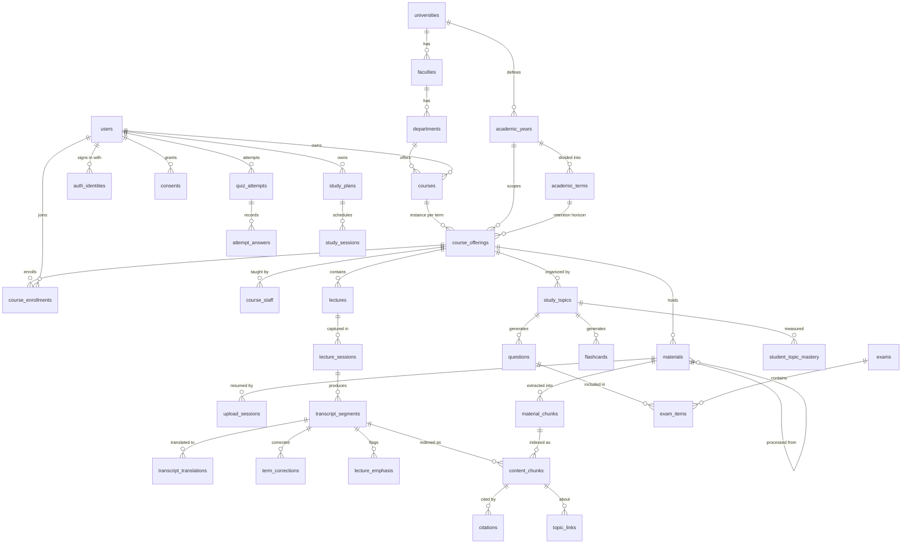

# DATABASE.md

PostgreSQL schema design for Sanad. Every academic concept is data; none is code.

**Status:** decisions finalized. Identity, academic structure, and courses are implemented in migration `0000`; later domains are designed but not yet migrated.

---

## 1. Principles

1. **PostgreSQL is the source of truth.** Object storage holds bytes; Postgres holds everything else, including every reference to those bytes.
2. **Normalized, with two deliberate exceptions** — `content_chunks` (§6) and `citations` (§8) — each justified in place.
3. **Course-agnostic by construction.** Vocabulary, topics, emphasis cues, question profiles, and academic structure are all rows. There is no table whose meaning depends on a subject.
4. **Nothing is silently destroyed.** Raw transcription, uploaded originals, and prior generations are retained; corrections and regenerations are additive.
5. **Migration-based.** Drizzle owns the schema (see [ARCHITECTURE.md](ARCHITECTURE.md) §3.3). Every change is a reviewed, versioned migration file. No hand-edits to a live database, ever.

### Conventions

| Convention | Choice | Why |
|---|---|---|
| Primary key | `uuid` (UUIDv7, generated by the app) | Non-sequential publicly, but time-ordered internally, so B-tree locality doesn't collapse the way random UUIDv4 keys do |
| Timestamps | `timestamptz`, UTC | `created_at` everywhere; `updated_at` where rows mutate |
| Deletion | `deleted_at` on user-facing content; hard delete elsewhere | Recovering a mis-deleted lecture matters; a job row is not worth keeping |
| Naming | `snake_case`, plural tables, `<singular>_id` FKs | Predictable joins |
| Enums | Postgres enums for closed sets; lookup tables for extensible ones | An extensible set behind an enum forces a migration for what should be a row |
| Money/precision | `numeric`, never `float` | — |
| Text | `text` with `check` constraints, not `varchar(n)` | — |

---

## 2. Entity map



Six domains follow: identity and academic structure, lectures and transcripts, vocabulary and corrections, materials, retrieval and knowledge, learning and coaching.

---

## 3. Identity and academic structure

```sql
CREATE TYPE user_role AS ENUM ('student', 'teaching_assistant', 'instructor', 'admin');

CREATE TABLE users (
  id                uuid PRIMARY KEY,
  email             text NOT NULL,
  email_normalized  text NOT NULL,
  role              user_role NOT NULL DEFAULT 'student',
  display_name      text NOT NULL,
  interface_locale  text NOT NULL DEFAULT 'en',     -- BCP-47; independent of content language
  timezone          text NOT NULL DEFAULT 'UTC',    -- scheduling requires this
  email_verified_at timestamptz,
  created_at        timestamptz NOT NULL DEFAULT now(),
  updated_at        timestamptz NOT NULL DEFAULT now(),
  deleted_at        timestamptz,
  CONSTRAINT users_email_normalized_key UNIQUE (email_normalized)
);

**Credentials are not columns on `users`.** Email/password is the only MVP method, but it is stored as one row in `auth_identities` so that adding Google or Apple later is a new row type rather than a migration of the user table ([ARCHITECTURE.md](ARCHITECTURE.md) §3.7).

```sql
CREATE TYPE auth_provider AS ENUM ('password', 'google', 'apple');

CREATE TABLE auth_identities (
  id                  uuid PRIMARY KEY,
  user_id             uuid NOT NULL REFERENCES users(id) ON DELETE CASCADE,
  provider            auth_provider NOT NULL,
  provider_account_id text NOT NULL,        -- email for 'password'; subject id for federated
  password_hash       text,                 -- Argon2id; null for federated providers
  created_at          timestamptz NOT NULL DEFAULT now(),
  last_used_at        timestamptz,
  UNIQUE (provider, provider_account_id),
  CONSTRAINT auth_identities_password_ck
    CHECK ((provider = 'password') = (password_hash IS NOT NULL))
);
CREATE INDEX auth_identities_user_idx ON auth_identities (user_id);
```

The `CHECK` makes the two states mutually exclusive: a password identity always has a hash, a federated identity never does.

```sql
CREATE TABLE sessions (
  id           uuid PRIMARY KEY,
  user_id      uuid NOT NULL REFERENCES users(id) ON DELETE CASCADE,
  token_hash   text NOT NULL UNIQUE,               -- the token itself is never stored
  expires_at   timestamptz NOT NULL,
  created_at   timestamptz NOT NULL DEFAULT now(),
  last_used_at timestamptz NOT NULL DEFAULT now(),
  user_agent   text
);
CREATE INDEX sessions_user_idx ON sessions (user_id, expires_at DESC);

Registration asks for university, faculty, and department. None of that data exists on day one, so **a student may create a reference entry that is missing**, marked unverified. Without this, registration deadlocks on empty reference tables.

```sql
CREATE TABLE universities (
  id          uuid PRIMARY KEY,
  name        text NOT NULL,
  country     text,
  is_verified boolean NOT NULL DEFAULT false,   -- false = student-provisioned
  created_by  uuid REFERENCES users(id) ON DELETE SET NULL,
  created_at  timestamptz NOT NULL DEFAULT now(),
  UNIQUE (name, country)
);

CREATE TABLE faculties (
  id            uuid PRIMARY KEY,
  university_id uuid NOT NULL REFERENCES universities(id) ON DELETE CASCADE,
  name          text NOT NULL,
  is_verified   boolean NOT NULL DEFAULT false,
  created_by    uuid REFERENCES users(id) ON DELETE SET NULL,
  created_at    timestamptz NOT NULL DEFAULT now(),
  UNIQUE (university_id, name)
);

CREATE TABLE departments (
  id          uuid PRIMARY KEY,
  faculty_id  uuid NOT NULL REFERENCES faculties(id) ON DELETE CASCADE,
  name        text NOT NULL,
  is_verified boolean NOT NULL DEFAULT false,
  created_by  uuid REFERENCES users(id) ON DELETE SET NULL,
  created_at  timestamptz NOT NULL DEFAULT now(),
  UNIQUE (faculty_id, name)
);

CREATE TABLE academic_years (
  id            uuid PRIMARY KEY,
  university_id uuid NOT NULL REFERENCES universities(id) ON DELETE CASCADE,
  label         text NOT NULL,          -- "2025/2026" — a label, never parsed for meaning
  starts_on     date NOT NULL,
  ends_on       date NOT NULL,
  UNIQUE (university_id, label),
  CHECK (ends_on > starts_on)
);

-- Terms carry the dates that drive recording retention (§16)
CREATE TABLE academic_terms (
  id               uuid PRIMARY KEY,
  academic_year_id uuid NOT NULL REFERENCES academic_years(id) ON DELETE CASCADE,
  label            text NOT NULL,        -- "Fall", "Semester 2", "Summer"
  is_summer        boolean NOT NULL DEFAULT false,
  starts_on        date NOT NULL,
  ends_on          date NOT NULL,        -- recording retention horizon
  UNIQUE (academic_year_id, label),
  CHECK (ends_on > starts_on)
);
```

### Profiles

Kept separate from `users` because each role carries different fields, and a single wide table with mostly-null columns loses the ability to make any of them `NOT NULL`.

```sql
CREATE TABLE student_profiles (
  user_id          uuid PRIMARY KEY REFERENCES users(id) ON DELETE CASCADE,
  university_id    uuid REFERENCES universities(id) ON DELETE SET NULL,
  department_id    uuid REFERENCES departments(id) ON DELETE SET NULL,
  academic_year_id uuid REFERENCES academic_years(id) ON DELETE SET NULL,
  major            text,                  -- free text; department is the structured field
  student_number   text,
  created_at       timestamptz NOT NULL DEFAULT now(),
  updated_at       timestamptz NOT NULL DEFAULT now(),
  UNIQUE (university_id, student_number)
);

CREATE TABLE instructor_profiles (
  user_id       uuid PRIMARY KEY REFERENCES users(id) ON DELETE CASCADE,
  university_id uuid REFERENCES universities(id) ON DELETE SET NULL,
  department_id uuid REFERENCES departments(id) ON DELETE SET NULL,
  title         text,
  created_at    timestamptz NOT NULL DEFAULT now()
);

CREATE TABLE teaching_assistant_profiles (
  user_id       uuid PRIMARY KEY REFERENCES users(id) ON DELETE CASCADE,
  university_id uuid REFERENCES universities(id) ON DELETE SET NULL,
  department_id uuid REFERENCES departments(id) ON DELETE SET NULL,
  created_at    timestamptz NOT NULL DEFAULT now()
);
```

### Courses and offerings

**Design note — why `course_offerings` exists.** `courses` is the catalogue entry ("CS201 Data Structures"); `course_offerings` is one delivery of it in one academic term. Content, enrollment, and staffing hang off the *offering*, because the same course taken next year is a different set of lectures. Without this split, academic terms have nowhere meaningful to attach, reusing a course across years corrupts one year's retrieval scope with another's, and recording retention — which keys off the term end date (§16) — has no anchor.

**Courses are student-owned.** `owner_user_id` is the authority for update and delete. A student creating "Physics" gets a course *and* one offering in the current term, created together in a single transaction — the split never surfaces in the UI. `university_id` is nullable, because a student may create a course before any institutional record exists.

The API presents an offering to a student simply as "a course" ([API.md](API.md) §5); the split is internal.

```sql
CREATE TABLE courses (
  id            uuid PRIMARY KEY,
  owner_user_id uuid NOT NULL REFERENCES users(id) ON DELETE CASCADE,  -- authority for update/delete
  university_id uuid REFERENCES universities(id) ON DELETE SET NULL,
  department_id uuid REFERENCES departments(id) ON DELETE SET NULL,
  code          text,                       -- "CS201" — opaque to the application
  title         text NOT NULL,
  description   text,
  color         text,                       -- UI affordance only
  is_demo       boolean NOT NULL DEFAULT false,   -- seed fixtures flag themselves
  created_at    timestamptz NOT NULL DEFAULT now(),
  updated_at    timestamptz NOT NULL DEFAULT now(),
  deleted_at    timestamptz
);
CREATE INDEX courses_owner_idx ON courses (owner_user_id) WHERE deleted_at IS NULL;

CREATE TABLE course_offerings (
  id                  uuid PRIMARY KEY,
  course_id           uuid NOT NULL REFERENCES courses(id) ON DELETE CASCADE,
  term_id             uuid REFERENCES academic_terms(id) ON DELETE SET NULL,
  term_label          text,                        -- fallback when no institutional term exists
  primary_language    text NOT NULL DEFAULT 'ar',  -- content language hint, not a constraint
  secondary_languages text[] NOT NULL DEFAULT '{}',-- e.g. {en} for code-switched delivery
  question_profile    jsonb NOT NULL DEFAULT '{}', -- per-course generation config; never subject logic in code
  created_at          timestamptz NOT NULL DEFAULT now(),
  UNIQUE (course_id, term_id)
);
CREATE INDEX course_offerings_course_idx ON course_offerings (course_id);

CREATE TYPE enrollment_status AS ENUM ('active', 'completed', 'dropped');

CREATE TABLE course_enrollments (
  id           uuid PRIMARY KEY,
  offering_id  uuid NOT NULL REFERENCES course_offerings(id) ON DELETE CASCADE,
  user_id      uuid NOT NULL REFERENCES users(id) ON DELETE CASCADE,
  status       enrollment_status NOT NULL DEFAULT 'active',
  enrolled_at  timestamptz NOT NULL DEFAULT now(),
  UNIQUE (offering_id, user_id)
);
CREATE INDEX course_enrollments_user_idx ON course_enrollments (user_id, status);

CREATE TABLE course_staff (
  id          uuid PRIMARY KEY,
  offering_id uuid NOT NULL REFERENCES course_offerings(id) ON DELETE CASCADE,
  user_id     uuid NOT NULL REFERENCES users(id) ON DELETE CASCADE,
  staff_role  user_role NOT NULL,
  UNIQUE (offering_id, user_id)
);
```

---

## 4. Lectures and transcripts

```sql
CREATE TYPE lecture_status  AS ENUM ('scheduled', 'recording', 'processing', 'ready', 'failed');
CREATE TYPE capture_mode    AS ENUM ('live', 'upload');
CREATE TYPE confidence_band AS ENUM ('high', 'medium', 'low');

CREATE TABLE lectures (
  id           uuid PRIMARY KEY,
  offering_id  uuid NOT NULL REFERENCES course_offerings(id) ON DELETE CASCADE,
  title        text NOT NULL,
  sequence_no  integer,                 -- "Lecture 4"; nullable, courses vary
  occurred_on  date,
  status       lecture_status NOT NULL DEFAULT 'scheduled',
  created_by   uuid REFERENCES users(id) ON DELETE SET NULL,
  created_at   timestamptz NOT NULL DEFAULT now(),
  updated_at   timestamptz NOT NULL DEFAULT now(),
  deleted_at   timestamptz
);
CREATE INDEX lectures_offering_idx ON lectures (offering_id, occurred_on DESC) WHERE deleted_at IS NULL;

CREATE TABLE lecture_sessions (
  id                    uuid PRIMARY KEY,
  lecture_id            uuid NOT NULL REFERENCES lectures(id) ON DELETE CASCADE,
  capture_mode          capture_mode NOT NULL,
  recording_material_id uuid,                 -- FK added after materials (§6)
  started_at            timestamptz NOT NULL DEFAULT now(),
  ended_at              timestamptz,
  language_hints        text[] NOT NULL DEFAULT '{}',
  asr_provider          text,                 -- recorded per session: reproducibility
  asr_model             text,
  status                lecture_status NOT NULL DEFAULT 'recording',
  created_by            uuid REFERENCES users(id) ON DELETE SET NULL
);
```

### Transcript segments

The atomic unit of spoken content. **`raw_text` is written once and never updated** — corrections write `display_text` and a `term_corrections` row, so the original is always recoverable (§4 of the brief).

```sql
CREATE TABLE transcript_segments (
  id               uuid PRIMARY KEY,
  session_id       uuid NOT NULL REFERENCES lecture_sessions(id) ON DELETE CASCADE,
  lecture_id       uuid NOT NULL REFERENCES lectures(id) ON DELETE CASCADE,
  seq              integer NOT NULL,
  t_start_ms       integer NOT NULL,
  t_end_ms         integer NOT NULL,
  raw_text         text NOT NULL,               -- immutable ASR output
  display_text     text NOT NULL,               -- corrected; equals raw_text until corrected
  primary_language text,                        -- detected, nullable when uncertain
  is_code_switched boolean NOT NULL DEFAULT false,
  confidence       real,                        -- 0..1, normalized across providers
  confidence_band  confidence_band,
  no_speech_prob   real,
  speaker_label    text,
  created_at       timestamptz NOT NULL DEFAULT now(),
  UNIQUE (session_id, seq),
  CHECK (t_end_ms >= t_start_ms)
);
CREATE INDEX transcript_segments_lecture_time_idx ON transcript_segments (lecture_id, t_start_ms);
CREATE INDEX transcript_segments_low_conf_idx
  ON transcript_segments (lecture_id) WHERE confidence_band = 'low';
```

### Translations

The source transcript always remains (§4 of the brief). Translations are additive rows, and any number of target languages may exist.

**Generated on demand, then cached.** A student selects a display language and only that language is produced. Pre-generating every supported language for every segment would multiply cost and latency by the size of the language list for translations nobody reads.

```sql
CREATE TABLE transcript_translations (
  id              uuid PRIMARY KEY,
  segment_id      uuid NOT NULL REFERENCES transcript_segments(id) ON DELETE CASCADE,
  lecture_id      uuid NOT NULL REFERENCES lectures(id) ON DELETE CASCADE,  -- batch by lecture
  target_language text NOT NULL,             -- BCP-47; no fixed set in code
  text            text NOT NULL,
  provider        text NOT NULL,
  model           text NOT NULL,
  created_at      timestamptz NOT NULL DEFAULT now(),
  UNIQUE (segment_id, target_language)
);
CREATE INDEX transcript_translations_lecture_lang_idx
  ON transcript_translations (lecture_id, target_language);
```

Requesting a language that is not yet cached enqueues a per-lecture translation job and returns the source transcript meanwhile ([API.md](API.md) §4). The supported-language list is configuration, not an enum — Arabic, English, and Chinese are the initial set, and a fourth is a config entry plus a provider that supports it.

---

## 5. Vocabulary, corrections, emphasis

Three tables that carry all subject-specific knowledge in the system. **This is where "course-agnostic" is actually implemented** — everything a Digital Logic build would hard-code lives here as rows, and a Pharmacology course populates the same tables with entirely different content.

```sql
CREATE TYPE vocabulary_source AS ENUM ('manual', 'derived', 'imported');

-- Global academic vocabulary: cross-course terms
CREATE TABLE technical_terms (
  id             uuid PRIMARY KEY,
  canonical_term text NOT NULL,
  language       text NOT NULL,
  aliases        text[] NOT NULL DEFAULT '{}',   -- transliterations, misrecognitions, plurals
  notes          text,
  created_at     timestamptz NOT NULL DEFAULT now(),
  UNIQUE (canonical_term, language)
);

-- Course-scoped vocabulary: overrides and extends the global set
CREATE TABLE course_vocabulary (
  id             uuid PRIMARY KEY,
  offering_id    uuid NOT NULL REFERENCES course_offerings(id) ON DELETE CASCADE,
  canonical_term text NOT NULL,
  language       text NOT NULL,
  aliases        text[] NOT NULL DEFAULT '{}',
  weight         real NOT NULL DEFAULT 1.0,      -- ASR bias strength and expansion priority
  source         vocabulary_source NOT NULL DEFAULT 'manual',
  created_by     uuid REFERENCES users(id) ON DELETE SET NULL,
  created_at     timestamptz NOT NULL DEFAULT now(),
  UNIQUE (offering_id, canonical_term, language)
);
CREATE INDEX course_vocabulary_alias_idx ON course_vocabulary USING gin (aliases);
```

Vocabulary can be **derived** from a course's own uploaded materials (`source='derived'`) — which is how a new course is bootstrapped without anyone hand-writing a term list. See [AI_PIPELINE.md](AI_PIPELINE.md) §4.

```sql
CREATE TYPE correction_method AS ENUM ('asr_bias', 'lexicon', 'llm_context', 'manual');

CREATE TABLE term_corrections (
  id            uuid PRIMARY KEY,
  segment_id    uuid NOT NULL REFERENCES transcript_segments(id) ON DELETE CASCADE,
  offering_id   uuid NOT NULL REFERENCES course_offerings(id) ON DELETE CASCADE,
  raw_term      text NOT NULL,
  corrected_term text NOT NULL,
  vocabulary_id uuid REFERENCES course_vocabulary(id) ON DELETE SET NULL,
  method        correction_method NOT NULL,
  confidence    real NOT NULL,
  char_start    integer,
  char_end      integer,
  applied       boolean NOT NULL DEFAULT true,   -- false = suggested, below threshold
  created_at    timestamptz NOT NULL DEFAULT now()
);
CREATE INDEX term_corrections_segment_idx ON term_corrections (segment_id);
```

Every correction is auditable: what was heard, what it became, by which method, with what confidence — the record needed to evaluate the pipeline and to show a student why a word changed.

### Emphasis

Cue phrases are **rows, not code** (§32 of the brief). Adding a dialect or a language is an insert.

```sql
CREATE TYPE importance_type AS ENUM ('exam_relevant', 'key_concept', 'common_mistake', 'repeat_emphasis');

CREATE TABLE emphasis_cues (
  id         uuid PRIMARY KEY,
  language   text NOT NULL,
  pattern    text NOT NULL,              -- normalized phrase or regex
  is_regex   boolean NOT NULL DEFAULT false,
  cue_type   importance_type NOT NULL,
  weight     real NOT NULL DEFAULT 1.0,
  is_active  boolean NOT NULL DEFAULT true,
  UNIQUE (language, pattern)
);

CREATE TABLE lecture_emphasis (
  id              uuid PRIMARY KEY,
  lecture_id      uuid NOT NULL REFERENCES lectures(id) ON DELETE CASCADE,
  segment_id      uuid NOT NULL REFERENCES transcript_segments(id) ON DELETE CASCADE,
  topic_id        uuid,                      -- FK added after study_topics (§7)
  quote           text NOT NULL,             -- the instructor's actual words
  t_start_ms      integer NOT NULL,
  importance_type importance_type NOT NULL,
  confidence      real NOT NULL,
  cue_id          uuid REFERENCES emphasis_cues(id) ON DELETE SET NULL,
  detected_by     text NOT NULL,             -- 'cue' | 'llm' | 'cue+llm'
  verified        boolean NOT NULL DEFAULT false,
  created_at      timestamptz NOT NULL DEFAULT now()
);
CREATE INDEX lecture_emphasis_lecture_idx ON lecture_emphasis (lecture_id, t_start_ms);
```

---

## 6. Materials and the retrieval unit

```sql
CREATE TYPE material_type      AS ENUM ('pdf','ppt','pptx','doc','docx','image','audio','video','text','other');
CREATE TYPE processing_status  AS ENUM ('pending_upload','uploaded','extracting','chunking','embedding','ready','failed');
CREATE TYPE material_role      AS ENUM ('original','processed');

CREATE TABLE materials (
  id                uuid PRIMARY KEY,
  offering_id       uuid NOT NULL REFERENCES course_offerings(id) ON DELETE CASCADE,
  lecture_id        uuid REFERENCES lectures(id) ON DELETE SET NULL,
  uploader_user_id  uuid NOT NULL REFERENCES users(id) ON DELETE CASCADE,
  title             text NOT NULL,
  material_type     material_type NOT NULL,
  mime_type         text NOT NULL,
  byte_size         bigint NOT NULL,
  checksum_sha256   text NOT NULL,
  storage_provider  text NOT NULL,          -- 's3' | 'minio' | …  (§18 of brief: replaceable)
  storage_key       text NOT NULL,          -- reference only; bytes never in Postgres
  page_count        integer,
  duration_ms       integer,
  processing_status processing_status NOT NULL DEFAULT 'pending_upload',
  processing_error  text,

  -- audio processing (§10 of the brief): the original is never replaced
  role                   material_role NOT NULL DEFAULT 'original',
  derived_from_material_id uuid REFERENCES materials(id) ON DELETE CASCADE,

  -- offline capture: idempotency for retried uploads
  client_ref        text,                    -- client-generated id, stable across retries

  -- retention (§16)
  retention_expires_at timestamptz,          -- null = derived content, kept indefinitely

  created_at        timestamptz NOT NULL DEFAULT now(),
  updated_at        timestamptz NOT NULL DEFAULT now(),
  deleted_at        timestamptz,
  UNIQUE (offering_id, checksum_sha256),     -- same file uploaded twice is one material
  UNIQUE (uploader_user_id, client_ref),     -- same recording retried is one material
  CONSTRAINT materials_derived_ck CHECK ((role = 'processed') = (derived_from_material_id IS NOT NULL))
);
CREATE INDEX materials_retention_idx ON materials (retention_expires_at)
  WHERE retention_expires_at IS NOT NULL AND deleted_at IS NULL;
CREATE INDEX materials_offering_idx ON materials (offering_id, created_at DESC) WHERE deleted_at IS NULL;

ALTER TABLE lecture_sessions
  ADD CONSTRAINT lecture_sessions_recording_fk
  FOREIGN KEY (recording_material_id) REFERENCES materials(id) ON DELETE SET NULL;

-- Extraction output: preserves the document's own structure
CREATE TABLE material_chunks (
  id          uuid PRIMARY KEY,
  material_id uuid NOT NULL REFERENCES materials(id) ON DELETE CASCADE,
  seq         integer NOT NULL,
  text        text NOT NULL,
  page_no     integer,
  slide_no    integer,
  char_start  integer,
  char_end    integer,
  language    text,
  extractor   text NOT NULL,                -- which extractor and version produced this
  created_at  timestamptz NOT NULL DEFAULT now(),
  UNIQUE (material_id, seq)
);
```

### `content_chunks` — one index for everything

Every retrievable thing, whatever its origin, becomes a row here. One table means one vector index, one lexical index, one ranking function, and **one citation format**.

*This duplicates text from `material_chunks` and `transcript_segments`, deliberately.* The extraction tables preserve the source's own structure so chunking strategy can be re-tuned without re-extracting every file or re-running ASR — a re-chunk rebuilds `content_chunks` from data already in Postgres. That is worth the storage, which is text measured in megabytes per course.

```sql
CREATE TYPE chunk_source_type AS ENUM ('transcript', 'material', 'note');

CREATE TABLE content_chunks (
  id                uuid PRIMARY KEY,
  offering_id       uuid NOT NULL REFERENCES course_offerings(id) ON DELETE CASCADE,
  source_type       chunk_source_type NOT NULL,

  -- provenance (exactly one branch populated; enforced below)
  lecture_id        uuid REFERENCES lectures(id) ON DELETE CASCADE,
  session_id        uuid REFERENCES lecture_sessions(id) ON DELETE CASCADE,
  segment_start_id  uuid REFERENCES transcript_segments(id) ON DELETE CASCADE,
  segment_end_id    uuid REFERENCES transcript_segments(id) ON DELETE CASCADE,
  material_id       uuid REFERENCES materials(id) ON DELETE CASCADE,
  material_chunk_id uuid REFERENCES material_chunks(id) ON DELETE CASCADE,

  -- citation anchors: what the UI jumps to
  t_start_ms        integer,
  t_end_ms          integer,
  page_no           integer,
  slide_no          integer,
  char_start        integer,
  char_end          integer,

  -- retrieval payload
  text              text NOT NULL,
  text_normalized   text NOT NULL,            -- Arabic-normalized; see §11
  expanded_terms    text[] NOT NULL DEFAULT '{}',  -- canonical terms for cross-lingual match
  language          text,
  token_count       integer,
  confidence        real,                     -- inherited from ASR; down-weights shaky audio

  -- embedding, with its own identity
  embedding            vector(1024),
  embedding_model      text,
  embedding_dimensions integer,
  embedded_at          timestamptz,

  search_tsv        tsvector,
  created_at        timestamptz NOT NULL DEFAULT now(),

  CONSTRAINT content_chunks_provenance_ck CHECK (
    (source_type = 'transcript' AND segment_start_id IS NOT NULL AND material_id IS NULL)
    OR (source_type = 'material' AND material_chunk_id IS NOT NULL AND segment_start_id IS NULL)
    OR (source_type = 'note')
  ),
  CONSTRAINT content_chunks_anchor_ck CHECK (
    t_start_ms IS NOT NULL OR page_no IS NOT NULL OR slide_no IS NOT NULL OR char_start IS NOT NULL
  )
);
```

**`content_chunks_anchor_ck` is the most important constraint in the schema.** A chunk with no anchor is a chunk that cannot be cited, and the database refuses to store one. The retrieve-or-refuse guarantee (§10 of the brief) rests on it being impossible to construct uncitable content, not on remembering to add citations later.

```sql
CREATE INDEX content_chunks_embedding_idx ON content_chunks
  USING hnsw (embedding vector_cosine_ops) WITH (m = 16, ef_construction = 64);
CREATE INDEX content_chunks_tsv_idx       ON content_chunks USING gin (search_tsv);
CREATE INDEX content_chunks_terms_idx     ON content_chunks USING gin (expanded_terms);
CREATE INDEX content_chunks_offering_idx  ON content_chunks (offering_id, source_type);
CREATE INDEX content_chunks_lecture_idx   ON content_chunks (lecture_id, t_start_ms);
CREATE INDEX content_chunks_pending_idx   ON content_chunks (created_at) WHERE embedding IS NULL;
```

Retrieval always filters by `offering_id` first, which is both a correctness boundary (a student's answer may never draw on another course) and the reason HNSW stays fast — the candidate set is one course, not the corpus.

---

## 7. Knowledge, topics, and generated study content

### Topics are derived per course, never enumerated in code

```sql
CREATE TYPE topic_source AS ENUM ('derived', 'manual', 'syllabus');

CREATE TABLE study_topics (
  id              uuid PRIMARY KEY,
  offering_id     uuid NOT NULL REFERENCES course_offerings(id) ON DELETE CASCADE,
  parent_topic_id uuid REFERENCES study_topics(id) ON DELETE SET NULL,
  name            text NOT NULL,
  slug            text NOT NULL,
  description     text,
  source          topic_source NOT NULL DEFAULT 'derived',
  created_at      timestamptz NOT NULL DEFAULT now(),
  UNIQUE (offering_id, slug)
);

CREATE TABLE topic_links (
  id        uuid PRIMARY KEY,
  topic_id  uuid NOT NULL REFERENCES study_topics(id) ON DELETE CASCADE,
  chunk_id  uuid NOT NULL REFERENCES content_chunks(id) ON DELETE CASCADE,
  relevance real NOT NULL DEFAULT 1.0,
  UNIQUE (topic_id, chunk_id)
);

ALTER TABLE lecture_emphasis
  ADD CONSTRAINT lecture_emphasis_topic_fk
  FOREIGN KEY (topic_id) REFERENCES study_topics(id) ON DELETE SET NULL;
```

### Summaries and keywords

```sql
CREATE TYPE summary_scope AS ENUM ('lecture', 'offering', 'topic', 'exam');

CREATE TABLE summaries (
  id           uuid PRIMARY KEY,
  scope_type   summary_scope NOT NULL,
  scope_id     uuid NOT NULL,             -- polymorphic; resolved in application code
  offering_id  uuid NOT NULL REFERENCES course_offerings(id) ON DELETE CASCADE,
  language     text NOT NULL,
  style        text NOT NULL DEFAULT 'standard',
  content      text NOT NULL,
  model        text NOT NULL,
  is_current   boolean NOT NULL DEFAULT true,   -- regeneration supersedes, never overwrites
  generated_at timestamptz NOT NULL DEFAULT now()
);
CREATE INDEX summaries_scope_idx ON summaries (scope_type, scope_id) WHERE is_current;

CREATE TABLE keywords (
  id          uuid PRIMARY KEY,
  offering_id uuid NOT NULL REFERENCES course_offerings(id) ON DELETE CASCADE,
  lecture_id  uuid REFERENCES lectures(id) ON DELETE CASCADE,
  topic_id    uuid REFERENCES study_topics(id) ON DELETE SET NULL,
  term        text NOT NULL,
  weight      real NOT NULL DEFAULT 1.0,
  created_at  timestamptz NOT NULL DEFAULT now()
);
```

### Flashcards, questions, exams

```sql
CREATE TYPE question_type AS ENUM ('mcq','true_false','short_answer','written','numeric','matching');

CREATE TABLE flashcards (
  id              uuid PRIMARY KEY,
  offering_id     uuid NOT NULL REFERENCES course_offerings(id) ON DELETE CASCADE,
  topic_id        uuid REFERENCES study_topics(id) ON DELETE SET NULL,
  front           text NOT NULL,
  back            text NOT NULL,
  language        text NOT NULL,
  source_chunk_id uuid NOT NULL REFERENCES content_chunks(id) ON DELETE CASCADE,
  model           text,
  created_at      timestamptz NOT NULL DEFAULT now()
);

CREATE TABLE questions (
  id              uuid PRIMARY KEY,
  offering_id     uuid NOT NULL REFERENCES course_offerings(id) ON DELETE CASCADE,
  topic_id        uuid REFERENCES study_topics(id) ON DELETE SET NULL,
  question_type   question_type NOT NULL,
  stem            text NOT NULL,
  model_answer    text,
  explanation     text,
  difficulty      real,
  language        text NOT NULL,
  source_chunk_id uuid NOT NULL REFERENCES content_chunks(id) ON DELETE CASCADE,
  emphasis_id     uuid REFERENCES lecture_emphasis(id) ON DELETE SET NULL,  -- exam-flagged origin
  model           text,
  created_at      timestamptz NOT NULL DEFAULT now()
);

CREATE TABLE question_options (
  id          uuid PRIMARY KEY,
  question_id uuid NOT NULL REFERENCES questions(id) ON DELETE CASCADE,
  seq         integer NOT NULL,
  text        text NOT NULL,
  is_correct  boolean NOT NULL DEFAULT false,
  UNIQUE (question_id, seq)
);
```

`source_chunk_id` is `NOT NULL` on both. A generated item that cannot name its source cannot be inserted — the same structural guarantee as the anchor constraint in §6, applied to generated content.

```sql
CREATE TYPE exam_mode_kind AS ENUM ('practice', 'final_review', 'topic_drill');

CREATE TABLE exams (
  id              uuid PRIMARY KEY,
  offering_id     uuid NOT NULL REFERENCES course_offerings(id) ON DELETE CASCADE,
  student_user_id uuid NOT NULL REFERENCES users(id) ON DELETE CASCADE,
  title           text NOT NULL,
  mode            exam_mode_kind NOT NULL DEFAULT 'practice',
  config          jsonb NOT NULL DEFAULT '{}',   -- counts, types, topic filters
  generated_at    timestamptz NOT NULL DEFAULT now()
);

CREATE TABLE exam_items (
  id          uuid PRIMARY KEY,
  exam_id     uuid NOT NULL REFERENCES exams(id) ON DELETE CASCADE,
  question_id uuid NOT NULL REFERENCES questions(id) ON DELETE CASCADE,
  seq         integer NOT NULL,
  weight      real NOT NULL DEFAULT 1.0,
  UNIQUE (exam_id, seq)
);

CREATE TABLE quiz_attempts (
  id              uuid PRIMARY KEY,
  student_user_id uuid NOT NULL REFERENCES users(id) ON DELETE CASCADE,
  offering_id     uuid NOT NULL REFERENCES course_offerings(id) ON DELETE CASCADE,
  exam_id         uuid REFERENCES exams(id) ON DELETE SET NULL,
  started_at      timestamptz NOT NULL DEFAULT now(),
  completed_at    timestamptz,
  score           real,
  max_score       real
);
CREATE INDEX quiz_attempts_student_idx ON quiz_attempts (student_user_id, offering_id, started_at DESC);

CREATE TABLE attempt_answers (
  id           uuid PRIMARY KEY,
  attempt_id   uuid NOT NULL REFERENCES quiz_attempts(id) ON DELETE CASCADE,
  question_id  uuid NOT NULL REFERENCES questions(id) ON DELETE CASCADE,
  topic_id     uuid REFERENCES study_topics(id) ON DELETE SET NULL,   -- denormalized for mastery
  response     jsonb NOT NULL,
  is_correct   boolean,
  score        real,
  time_ms      integer,
  answered_at  timestamptz NOT NULL DEFAULT now(),
  UNIQUE (attempt_id, question_id)
);
```

---

## 8. Q&A and citations

```sql
CREATE TABLE qa_conversations (
  id          uuid PRIMARY KEY,
  user_id     uuid NOT NULL REFERENCES users(id) ON DELETE CASCADE,
  offering_id uuid REFERENCES course_offerings(id) ON DELETE CASCADE,
  lecture_id  uuid REFERENCES lectures(id) ON DELETE SET NULL,
  title       text,
  created_at  timestamptz NOT NULL DEFAULT now()
);

CREATE TYPE qa_role AS ENUM ('user', 'assistant');

CREATE TABLE qa_messages (
  id               uuid PRIMARY KEY,
  conversation_id  uuid NOT NULL REFERENCES qa_conversations(id) ON DELETE CASCADE,
  role             qa_role NOT NULL,
  content          text NOT NULL,
  refused          boolean NOT NULL DEFAULT false,
  refusal_reason   text,                       -- 'below_threshold' | 'no_valid_citations'
  retrieval_top_score real,
  retrieved_chunk_ids uuid[],                  -- the validation set for citations
  model            text,
  latency_ms       integer,
  created_at       timestamptz NOT NULL DEFAULT now()
);
```

Storing `retrieved_chunk_ids` on the message makes citation validation **auditable after the fact**: any displayed citation can be re-checked against exactly what retrieval returned for that answer.

```sql
CREATE TYPE citation_target AS ENUM ('qa_message','summary','flashcard','question','exam_item','emphasis');

CREATE TABLE citations (
  id           uuid PRIMARY KEY,
  target_type  citation_target NOT NULL,
  target_id    uuid NOT NULL,
  chunk_id     uuid NOT NULL REFERENCES content_chunks(id) ON DELETE CASCADE,
  quote        text,                     -- the exact supporting span
  anchor       jsonb NOT NULL,           -- snapshot: {lecture, t_start_ms, page_no, …}
  rank         integer NOT NULL DEFAULT 0,
  validated    boolean NOT NULL DEFAULT false,
  created_at   timestamptz NOT NULL DEFAULT now()
);
CREATE INDEX citations_target_idx ON citations (target_type, target_id);
CREATE INDEX citations_chunk_idx  ON citations (chunk_id);
```

**Why `anchor` is a jsonb snapshot** — the second deliberate denormalization. A citation must still render correctly if the underlying chunk is later re-chunked or re-embedded. The live `chunk_id` gives the jump target; the snapshot preserves what was actually shown to the student at the time. Displayed history stays truthful even as the index evolves.

Only `validated = true` citations are ever rendered ([AI_PIPELINE.md](AI_PIPELINE.md) §6).

---

## 9. Learning memory and scheduling

Mastery is **structured records, never a prompt** (§13 of the brief).

```sql
CREATE TABLE student_topic_mastery (
  id                 uuid PRIMARY KEY,
  student_user_id    uuid NOT NULL REFERENCES users(id) ON DELETE CASCADE,
  topic_id           uuid NOT NULL REFERENCES study_topics(id) ON DELETE CASCADE,
  offering_id        uuid NOT NULL REFERENCES course_offerings(id) ON DELETE CASCADE,
  attempts           integer NOT NULL DEFAULT 0,
  correct            integer NOT NULL DEFAULT 0,
  accuracy           real NOT NULL DEFAULT 0,
  exposure_count     integer NOT NULL DEFAULT 0,   -- reviews, revisits, lecture replays
  mastery_score      real NOT NULL DEFAULT 0,      -- 0..1, formula in AI_PIPELINE.md §13
  confidence         real NOT NULL DEFAULT 0,      -- how much evidence supports the score
  is_weak            boolean NOT NULL DEFAULT false,
  last_reviewed_at   timestamptz,
  last_correct_at    timestamptz,
  last_incorrect_at  timestamptz,
  review_state       jsonb NOT NULL DEFAULT '{}',  -- spaced-repetition scheduler state
  updated_at         timestamptz NOT NULL DEFAULT now(),
  UNIQUE (student_user_id, topic_id)
);
CREATE INDEX mastery_weak_idx ON student_topic_mastery (student_user_id, offering_id)
  WHERE is_weak;
```

### Scheduling inputs

```sql
CREATE TYPE availability_kind AS ENUM ('study','work','gym','class','sleep','other');

CREATE TABLE study_availability (
  id              uuid PRIMARY KEY,
  student_user_id uuid NOT NULL REFERENCES users(id) ON DELETE CASCADE,
  weekday         smallint NOT NULL CHECK (weekday BETWEEN 0 AND 6),
  start_time      time NOT NULL,
  end_time        time NOT NULL,
  kind            availability_kind NOT NULL,
  is_available    boolean NOT NULL,          -- false = blocked (work, gym, sleep)
  effective_from  date,
  effective_to    date,
  CHECK (end_time > start_time)
);

CREATE TABLE student_commitments (
  id              uuid PRIMARY KEY,
  student_user_id uuid NOT NULL REFERENCES users(id) ON DELETE CASCADE,
  title           text NOT NULL,
  kind            availability_kind NOT NULL DEFAULT 'other',
  starts_at       timestamptz NOT NULL,
  ends_at         timestamptz NOT NULL,
  CHECK (ends_at > starts_at)
);

CREATE TABLE course_exams (
  id              uuid PRIMARY KEY,
  offering_id     uuid NOT NULL REFERENCES course_offerings(id) ON DELETE CASCADE,
  student_user_id uuid REFERENCES users(id) ON DELETE CASCADE,   -- null = course-wide
  title           text NOT NULL,
  exam_at         timestamptz NOT NULL,
  weight          real NOT NULL DEFAULT 1.0
);
```

### Plans

```sql
CREATE TYPE plan_status    AS ENUM ('active','superseded','archived');
CREATE TYPE session_status AS ENUM ('planned','completed','skipped','rescheduled');

CREATE TABLE study_plans (
  id                   uuid PRIMARY KEY,
  student_user_id      uuid NOT NULL REFERENCES users(id) ON DELETE CASCADE,
  horizon_start        date NOT NULL,
  horizon_end          date NOT NULL,
  status               plan_status NOT NULL DEFAULT 'active',
  generator_version    text NOT NULL,          -- deterministic scheduler version
  constraints_snapshot jsonb NOT NULL,         -- inputs used, for reproducibility
  generated_at         timestamptz NOT NULL DEFAULT now()
);
CREATE UNIQUE INDEX study_plans_one_active_idx
  ON study_plans (student_user_id) WHERE status = 'active';

CREATE TABLE study_sessions (
  id               uuid PRIMARY KEY,
  plan_id          uuid NOT NULL REFERENCES study_plans(id) ON DELETE CASCADE,
  student_user_id  uuid NOT NULL REFERENCES users(id) ON DELETE CASCADE,
  offering_id      uuid REFERENCES course_offerings(id) ON DELETE CASCADE,
  topic_id         uuid REFERENCES study_topics(id) ON DELETE SET NULL,
  starts_at        timestamptz NOT NULL,
  ends_at          timestamptz NOT NULL,
  activity_type    text NOT NULL,              -- 'review' | 'flashcards' | 'quiz' | 'read'
  priority_score   real NOT NULL,
  status           session_status NOT NULL DEFAULT 'planned',
  completed_at     timestamptz,
  actual_minutes   integer,
  CHECK (ends_at > starts_at),
  EXCLUDE USING gist (
    student_user_id WITH =,
    tstzrange(starts_at, ends_at) WITH &&
  ) WHERE (status = 'planned')
);
```

**The `EXCLUDE` constraint makes double-booking impossible at the database level.** §15 requires the scheduler never double-books; a constraint enforces that even if a scheduler bug tries. Studying-after-the-exam and unavailable-window rules are scheduler logic ([AI_PIPELINE.md](AI_PIPELINE.md) §12), but the overlap rule is cheap to guarantee here, so it is guaranteed here.

---

## 10. Operational tables

```sql
CREATE TYPE job_status AS ENUM ('pending','running','succeeded','failed','dead');

CREATE TABLE processing_jobs (
  id           uuid PRIMARY KEY,
  job_type     text NOT NULL,
  target_type  text NOT NULL,
  target_id    uuid NOT NULL,
  payload      jsonb NOT NULL DEFAULT '{}',
  status       job_status NOT NULL DEFAULT 'pending',
  attempts     integer NOT NULL DEFAULT 0,
  max_attempts integer NOT NULL DEFAULT 3,
  run_after    timestamptz NOT NULL DEFAULT now(),
  locked_by    text,
  locked_at    timestamptz,
  last_error   text,
  created_at   timestamptz NOT NULL DEFAULT now(),
  updated_at   timestamptz NOT NULL DEFAULT now()
);
CREATE INDEX processing_jobs_claim_idx ON processing_jobs (status, run_after)
  WHERE status = 'pending';

CREATE TABLE search_history (
  id               uuid PRIMARY KEY,
  user_id          uuid NOT NULL REFERENCES users(id) ON DELETE CASCADE,
  offering_id      uuid REFERENCES course_offerings(id) ON DELETE SET NULL,
  query            text NOT NULL,
  query_language   text,
  result_count     integer NOT NULL,
  top_score        real,
  clicked_chunk_id uuid REFERENCES content_chunks(id) ON DELETE SET NULL,
  created_at       timestamptz NOT NULL DEFAULT now()
);
CREATE INDEX search_history_user_idx ON search_history (user_id, created_at DESC);
```

`search_history` also becomes the click-through signal for retrieval evaluation, and later the substrate for the deferred instructor analytics — collected now, surfaced when there are enough students for it to mean anything.

---

## 11. Text normalization and lexical search

Postgres ships no Arabic stemmer, so lexical search uses the `simple` configuration over an application-normalized column:

- strip tashkeel (diacritics) and tatweel
- normalize `أ إ آ → ا`, `ى → ي`, `ة → ه`
- fold Arabic-Indic digits to ASCII
- lowercase and strip punctuation for the Latin portion

`text_normalized` is written at chunk time by one shared function, and **the identical function normalizes queries**. Divergence between index-time and query-time normalization is a silent retrieval failure that is miserable to debug, so both paths call the same code in `packages/core/text`.

```sql
-- maintained by the application on insert/update, not a trigger,
-- so normalization version changes are explicit re-index operations
UPDATE content_chunks SET search_tsv = to_tsvector('simple', text_normalized) WHERE id = $1;
```

---

## 12. Embedding versioning

**The MVP locks one model: BGE-M3 at 1024 dimensions** ([ARCHITECTURE.md](ARCHITECTURE.md) §3.9). `vector(1024)` in §6 is that decision, not a placeholder.

`embedding_model` and `embedding_dimensions` are still stored per row, because "locked" means *changed deliberately*, not *never changed*. A model change is then an explicit, resumable backfill rather than a silent corruption:

1. Deploy the new provider; new chunks embed with the new model.
2. Backfill job re-embeds old rows in batches.
3. Retrieval filters `embedding_model = <current>` during the transition, so results never mix incomparable vector spaces.
4. Once backfill completes, the filter is removed.

A dimension change additionally requires a new column and index; that migration is written when it happens, not pre-emptively.

---

## 13. Sizing

Per course-offering, for a full semester:

| Data | Estimate |
|---|---|
| Transcript segments | ~25 lectures × ~600 segments = 15,000 rows |
| Content chunks | ~8,000–12,000 rows |
| Embeddings (1024-d, float32) | ~4 KB each → **~40 MB** |
| Text | ~15 MB |
| Recordings, materials | GB-scale — **object storage, not Postgres** |

A single modest Postgres instance holds hundreds of course-offerings comfortably. HNSW over a per-offering filtered candidate set stays well inside interactive latency. Nothing here justifies a second datastore.

---

## 14. Migrations and seeding

- Migrations live in `packages/db/migrations`, are generated by Drizzle, reviewed as SQL, and applied in CI before tests.
- **Forward-only.** A mistake is corrected by a new migration, not by editing a released one.
- Seed data lives in `seed/` and is loaded by an explicit command, never automatically.
- **Every seed course is flagged `is_demo = true`** and lives entirely in data. Demo courses (Digital Logic among them) exist as fixtures; the CI course-agnostic check ([ARCHITECTURE.md](ARCHITECTURE.md) §1.1) fails the build if their vocabulary appears anywhere in application code.

## 15. Offline capture and upload sessions

A recording is made offline, queued, and uploaded when connectivity returns ([ARCHITECTURE.md](ARCHITECTURE.md) §3.10). Two failure modes the schema has to prevent: a partial upload restarting from zero, and a retried upload becoming a second copy of the same lecture.

```sql
CREATE TYPE upload_status AS ENUM ('pending','in_progress','completed','aborted','expired');

CREATE TABLE upload_sessions (
  id                 uuid PRIMARY KEY,
  user_id            uuid NOT NULL REFERENCES users(id) ON DELETE CASCADE,
  material_id        uuid NOT NULL REFERENCES materials(id) ON DELETE CASCADE,
  client_ref         text NOT NULL,          -- same value as materials.client_ref
  total_bytes        bigint NOT NULL,
  received_bytes     bigint NOT NULL DEFAULT 0,
  chunk_size         integer NOT NULL,
  storage_upload_id  text,                   -- provider multipart id
  storage_parts      jsonb NOT NULL DEFAULT '[]',  -- [{part_no, etag, bytes}]
  checksum_sha256    text NOT NULL,          -- computed client-side before upload starts
  status             upload_status NOT NULL DEFAULT 'pending',
  attempts           integer NOT NULL DEFAULT 0,
  last_error         text,
  created_at         timestamptz NOT NULL DEFAULT now(),
  updated_at         timestamptz NOT NULL DEFAULT now(),
  expires_at         timestamptz NOT NULL,
  UNIQUE (user_id, client_ref)
);
CREATE INDEX upload_sessions_resumable_idx ON upload_sessions (user_id, status)
  WHERE status IN ('pending','in_progress');
```

**How the two failure modes are closed.** `received_bytes` and `storage_parts` let a client ask "where did I get to?" and resume from that offset rather than the beginning — which matters when a lecture recording is tens of megabytes on a bad connection. `UNIQUE (user_id, client_ref)` on both this table and `materials` means a retry after an ambiguous network failure resolves to the *same* row: the client generates the ID before recording starts, so retrying is idempotent by construction rather than by server-side guesswork.

`checksum_sha256` is computed before upload begins and verified on completion. A mismatch fails the session rather than ingesting a corrupted recording.

---

## 16. Retention, consent, and deletion

### Recordings expire; derived content does not

| Data | Retention |
|---|---|
| Lecture recordings (`materials` where `role='original'`, audio/video) | Until the **end of the academic term** the offering belongs to; extended to the end of the summer term for students enrolled in one |
| Derived audio (`role='processed'`) | Deleted with its original |
| Transcripts, summaries, keywords, flashcards, questions, notes, metadata | **Indefinite** — until the student deletes them or their account |
| `qa_messages`, `search_history` | With the account |

`materials.retention_expires_at` is set at upload time from the offering's `academic_terms.ends_on`, which is why terms carry dates (§3). A nightly job deletes expired recordings and their storage objects. Students may delete a recording earlier at any time.

The asymmetry is deliberate. Audio is the large, sensitive, expensive asset and has a natural expiry; the study material derived from it is what a student needs next semester and beyond. Deleting the recording does not degrade the transcript, the search index, or any citation — anchors point at `transcript_segments`, not at the audio file. A citation whose recording has expired still resolves to its text; only playback is lost, and the UI says so rather than failing.

### Consent

Sanad records people speaking, so consent is captured **before any real lecture audio is collected — including benchmark audio** ([ARCHITECTURE.md](ARCHITECTURE.md) §9).

```sql
CREATE TABLE consents (
  id             uuid PRIMARY KEY,
  user_id        uuid NOT NULL REFERENCES users(id) ON DELETE CASCADE,
  consent_type   text NOT NULL,        -- 'recording' | 'terms' | 'privacy'
  policy_version text NOT NULL,
  granted_at     timestamptz NOT NULL DEFAULT now(),
  revoked_at     timestamptz,
  UNIQUE (user_id, consent_type, policy_version)
);
```

Versioning the policy is what makes a future change enforceable: a new version means the current acknowledgement no longer satisfies the check, and the flow runs again. Recording is blocked until `consent_type='recording'` is granted for the current version.

### Account deletion

Deletion cascades from `users` through every owned row — recordings, uploads, generated content, mastery, plans, conversations, search history — followed by an object-storage sweep for orphaned keys. Cascades are declared in the schema rather than implemented as application cleanup, so a new table cannot be forgotten: the foreign key makes deletion the default and retention the explicit choice.
