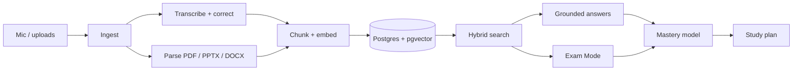

# Architecture

How the eight competition-scope features actually work. Written so the team can start building without another design meeting.

---

## The spine



One database, one index, one citation format. Everything downstream of `chunks` is a different read of the same table.

---

## 1. Live transcription

The hard constraint: Whisper-family models are not streaming models. We fake streaming with overlapping windows, which is standard and works well enough to feel live.

```
mic → VAD (Silero) → 4s windows, 1s overlap → ASR → draft text (grey, ~2s)
                                                   ↓
                              on speech-pause: finalize segment
                                                   ↓
                              correction pass (async) → final text (black, ~5s)
```

**Recognizer.** `faster-whisper` with `large-v3-turbo`, self-hosted on a single GPU. Runs comfortably faster than realtime for one stream, which is all a demo needs.

**Before committing, run a bake-off.** Take ten minutes of real Arabic/English Digital Logic audio and measure word error rate on *technical terms specifically* across `large-v3-turbo` and one hosted alternative. Code-switching is exactly where these models diverge most, and general benchmarks won't tell you which wins on this audio. Budget half a day for this — it de-risks the single riskiest component in the project.

**Known failure mode:** Whisper sometimes silently *translates* rather than transcribes when a sentence switches language. Pin `task="transcribe"` and verify on mixed audio, because this failure is quiet and destroys the code-switching demo.

### Two-tier display

Grey draft → black final isn't just an implementation artifact, it's the honest UI. It shows the system thinking and makes the correction pass visible instead of hiding it. Show a judge a word changing from "كي ماب" to **K-map** in real time and you've demonstrated feature #2 without explaining it.

### Technical-term correction

Two mechanisms stacked:

1. **Bias at recognition time.** Feed the course glossary through Whisper's `initial_prompt`. Cheap, no extra latency, catches a good share of terms.
2. **Correct at segment time.** Once a segment finalizes, one small LLM call with the glossary and the previous two segments as context. Async, so it never blocks display.

Use **Claude Haiku 4.5** (`claude-haiku-4-5`) here — this is a narrow, well-specified transform on short text, and per-segment latency matters more than reasoning depth.

The glossary is a per-course table of canonical terms plus their Arabic transliterations:

```
K-map          ← كي ماب, كاي ماب, خريطة كارنوف, karnaugh map
flip-flop      ← فليب فلوب, فلب فلوب
multiplexer    ← مالتيبلكسر, ماكس, mux
truth table    ← جدول الحقيقة, تروث تيبل
don't care     ← دونت كير
```

Seed roughly 80 terms for Digital Logic by hand. It takes an afternoon and it is the highest-leverage hour in the whole project — this table is what makes the transcription look *specialized* rather than generic.

### Confidence

Whisper returns `avg_logprob` and `no_speech_prob` per segment. Map to three bands (confident / uncertain / unclear), store on the chunk, render uncertain spans with a dotted underline. Uncertain chunks are also down-weighted in retrieval, so shaky audio doesn't become a confident wrong citation later.

---

## 2. Ingestion

| Type | Handling | Citation anchor |
|---|---|---|
| Lecture audio/video | ASR pipeline above | `t_start_ms` |
| PDF | Text layer; OCR fallback for scans | `page_no` |
| PPTX | Text + speaker notes per slide | `slide_no` |
| DOCX | Paragraph extraction | `char_offset` |
| Image | OCR (printed reliable, handwritten best-effort) | whole-image |
| Uploaded audio | Same ASR pipeline, batch mode | `t_start_ms` |

Every chunk carries its anchor from birth. There is no later step that "adds citations" — a chunk without a source pointer should be impossible to construct.

---

## 3. Retrieval

### Chunking

Transcripts chunk on speech boundaries into ~45-second spans with one span of overlap. Documents chunk by page, then split long pages semantically. Overlap matters: a definition that straddles a chunk edge is a definition you can't retrieve.

### Hybrid search

Dense vectors alone are weak on exact technical tokens — "K-map" and "K-maps" and "Karnaugh" need lexical matching. Run both and fuse:

- **Dense:** BGE-M3 or `multilingual-e5-large`. Both are strong on Arabic and both are natively multilingual, which is what makes cross-lingual retrieval work at all.
- **Lexical:** BM25 with Arabic normalization — strip tashkeel, normalize أ/إ/آ→ا, ى→ي, ة→ه.
- **Fuse:** reciprocal rank fusion, then rerank the top ~30.

### Cross-lingual retrieval

Searching `خريطة كارنوف` must return English-transcribed K-map content. Two mechanisms:

1. The multilingual embedding model handles this natively for general language.
2. For technical terms it isn't enough — so at index time, expand every chunk with the canonical English term for any glossary alias it contains, into a separate searchable field. The glossary from §1 does double duty here.

### Storage

Postgres with `pgvector` for everything — chunks, embeddings, users, plans, mastery. One database. A competition project does not need a separate vector store, and every extra piece of infrastructure is another thing that can fail live on stage.

```sql
chunk(
  id, course_id, source_id, text, text_normalized, lang,
  embedding vector(1024),
  t_start_ms, t_end_ms, page_no, slide_no,     -- citation anchors
  confidence, is_exam_flagged, flag_reason
)
```

---

## 4. Grounded answering

```
question → hybrid retrieve top-k → rerank → answer with citations → verify → render
```

**Model:** Claude Opus 5 (`claude-opus-5`, 1M context, $5/$25 per MTok). Adaptive thinking is on by default — leave it on.

**Three rules enforced in code, not just in the prompt:**

1. **Retrieve or refuse.** If the top fused score is below threshold, don't call the model at all. Return "I couldn't find this in your materials" and offer the nearest topics. This is a code path, not a hope.
2. **Every claim cites.** Answers reference chunk IDs; the renderer resolves them into clickable timestamps and page links.
3. **Verify before render.** Drop any citation whose ID wasn't in the retrieved set. Cheap, and it closes the hallucinated-citation hole entirely.

**Two citation mechanisms, and they don't mix.** For questions over an uploaded PDF, the API's native citations (`citations: {enabled: true}` on a document block) return exact `cited_text` with `page_location` — better than anything we'd build. For transcript-grounded answers, we use our own chunk IDs, because timestamps aren't a native anchor type. Note the constraint: **native citations and `output_config.format` are incompatible and return a 400 together** — so the PDF-citation path and the structured-generation path (§5) stay separate code paths. Design for that now rather than discovering it later.

**Caching.** The course corpus is stable across every question a student asks, which is the ideal prompt-caching shape. Put the fixed course context first, the varying question last. Verify it's working by checking `usage.cache_read_input_tokens` is non-zero — if it's zero across repeated queries, something volatile leaked into the prefix.

---

## 5. Exam Mode

Runs as a batch job, not a live request — the student presses the button and gets a pack. This means **Message Batches at 50% cost**, and latency stops mattering.

```
lecture transcripts + documents
        ↓
per-lecture: summary, concepts, exam-flags        (map)
        ↓
course-level: concept graph, repeated topics      (reduce)
        ↓
generate: flashcards, MCQs, written Qs, exam      (structured output)
        ↓
every item stores its source chunk_id
```

**Model:** Claude Opus 5 for generation quality — this artifact is what the student studies from, and it's generated once per course, so quality dominates cost. Use structured outputs (`output_config: {format: ...}`) so items come back as validated objects with a required `source_chunk_id` field. A question that can't name its source fails validation and never reaches the student.

### Professor-emphasis detection

The feature nobody else has. A pass over transcript segments looking for emphasis cues in both languages:

```
"دي مهمة للامتحان"    "ركزوا في النقطة دي"      "هتيجي في الامتحان"
"this is important"    "remember this"           "will be on the exam"
```

Cue phrases find candidates; a verification pass confirms them and stores `flag_reason`. Flagged concepts get weighted heavily in generation, and the UI shows the provenance: *"⚑ Lecture 6, 34:12 — the professor said this would be on the exam."*

Cheap to build, and it's the single most distinctive moment in the demo.

### Cost

A 50-minute lecture is roughly 12–20K tokens (Arabic tokenizes heavier than English). Full processing — summary, concepts, flags, cards, questions — runs around **$0.20 per lecture**. A twelve-lecture semester is under **$3**. A grounded Q&A turn with caching is a few cents.

Cost is a non-issue at demo scale. Don't spend engineering time optimizing it — spend it on transcription accuracy, which is the thing that can actually fail on stage.

---

## 6. Mastery model and study plan

### Memory, made concrete

"AI that remembers the student" is a real feature when it's a table, and vapor when it's a prompt. Per student per topic:

```sql
mastery(user_id, topic_id, exposures, correct, accuracy, last_seen_at, fsrs_state)
```

Every quiz answer, flashcard review, and revisited lecture segment updates it. This is what "gets smarter every day" means in practice, and it's queryable, testable, and explainable to a judge.

### Scheduling

Deterministic, not generative:

1. Available blocks = declared study hours − work − gym − sleep − classes.
2. Weight topics by `(1 − accuracy) × exam_proximity × decay(last_seen)`.
3. Fill blocks greedily by weight, respecting session length and spacing.
4. Interleave flashcard reviews on FSRS schedule.

The LLM's only job is writing the message around the plan — *"You're solid on Boolean algebra but K-maps are shaky. Let's give them 25 minutes before the Thursday exam."*

**Adaptivity** is re-running the scheduler on events: session completed, quiz scored, day missed, exam date moved. Two guardrails worth having: a fatigue rule that stops recommending work after a long day even when the plan says continue, and a re-plan on missed days so the student sees an updated plan instead of a wall of overdue red.

---

## 7. Stack

| Layer | Choice | Why |
|---|---|---|
| Web | Next.js + TypeScript | One codebase for the workspace UI; PWA path for offline caching later |
| API | Next.js routes + Python worker | Python owns ASR and ingestion; TS owns everything else |
| Queue | Redis + a worker process | Transcription and Exam Mode are jobs, not requests |
| DB | Postgres + pgvector | One store for relational + vector |
| ASR | faster-whisper `large-v3-turbo` | Self-hosted, no per-minute cost during development |
| Embeddings | BGE-M3 / `multilingual-e5-large` | Strong Arabic, natively cross-lingual |
| LLM | `claude-opus-5` (answers, generation), `claude-haiku-4-5` (term correction) | Depth where it's read by students; speed where it's per-segment |
| Realtime | WebSocket | Transcript streaming |

**Use the official Anthropic SDK** (`@anthropic-ai/sdk` / `anthropic`), not raw HTTP.

---

## Where this can fail

Ranked by probability × damage. Work top-down.

| Risk | Mitigation |
|---|---|
| **Code-switched ASR is worse than expected** | Bake off models in week 1. This is the load-bearing assumption of the entire product — find out early, while there's still time to change approach. |
| **Live demo audio fails** (mic, room noise, network) | Rehearse on a pre-recorded file, then do one short genuinely-live segment. Never let the whole demo depend on a stage microphone. |
| **Retrieval misses cross-lingual queries** | Glossary term expansion at index time, tested with an Arabic-query set before demo day. |
| **Exam Mode generates plausible but unsourced items** | Required `source_chunk_id` in the schema; validation drops anything without it. |
| **Scope creep back toward the blue list** | [`product-scope.md`](product-scope.md) is the contract. Blue features get slides. |
